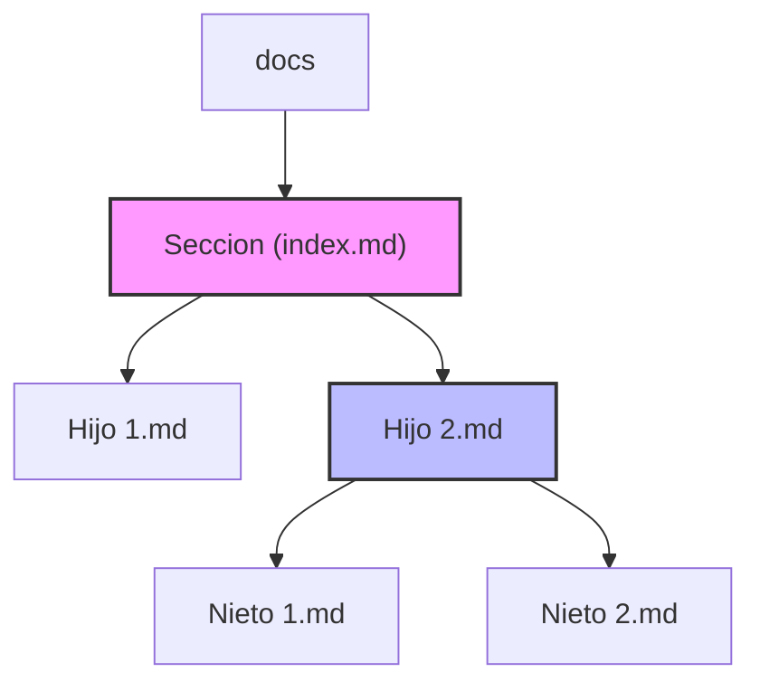

```bash
ALEDO-Docs
├─ index.md
├─ _config.yml
├─ Gemfile
├─ docs/
│  ├─ Departamentos/
│  │  ├─ index.md                  # "Departamentos" (índice principal)
│  │  ├─ Almacen.md
│  │  ├─ bebes_ninios.md
│  │  ├─ Bebidas.md
│  │  ├─ carnes.md
│  │  ├─ comidas_preparadas.md
│  │  ├─ congelados.md
│  │  ├─ frutas_verduras.md
│  │  ├─ hogar_textil.md
│  │  ├─ lacteos.md
│  │  ├─ Limpieza.md
│  │  ├─ mascotas.md
│  │  ├─ panaderia.md
│  │  ├─ pastas_frescas.md
│  │  ├─ perfumeria.md
│  │  └─ quesos_fiambres.md
│  ├─ sistemas/
│  │  ├─ index.md                  # "Sistemas" (sección padre)
│  │  ├─ impresoras-hasar.md
│  │  └─ redes-dhcp.md
│  └─ ventas/
│     ├─ index.md                  # "Ventas" (sección padre)
│     ├─ reportes-diarios.md
│     └─ pivots-cobertura.md
└─ assets/
   └─ img/                         # imágenes si las necesitás

````


# 📘 Guía práctica: agregar o mover carpetas en ALEDO-Docs (Jekyll + just-the-docs)

Cuando crees una nueva carpeta o muevas páginas en tu documentación, seguí este paso a paso.  
El objetivo es que **el sidebar se genere correctamente** y los enlaces no rompan.

---

## 1) Crear la carpeta y el índice

1. Crea la carpeta dentro de `docs/` (ejemplo: `docs/soporte/`).
2. Dentro de la carpeta, agrega un `index.md` con este front matter:

```md
---
layout: default
title: "Soporte"
nav_order: 5
has_children: true
---

# Soporte
Descripción general de la sección.
```

👉 Este archivo actúa como **padre** y permite que los hijos se agrupen en el sidebar.

---

## 2) Crear páginas hijas

Dentro de la carpeta, cada página `.md` debe tener:

```md
---
layout: default
title: "Conexión a red"
parent: "Soporte"
nav_order: 1
---

# Conexión a red
Instrucciones para…
```

👉 La clave está en el campo **`parent`**: debe coincidir exactamente con el `title` del padre.

---

## 3) Subniveles (nietos)

Si dentro de “Soporte” creas otra subcarpeta `windows/`, hacé esto:

**`docs/soporte/windows/index.md`**
```md
---
layout: default
title: "Windows"
parent: "Soporte"
has_children: true
nav_order: 2
---

# Windows
Guías relacionadas con Windows.
```

**`docs/soporte/windows/usuarios.md`**
```md
---
layout: default
title: "Usuarios en Windows"
parent: "Windows"
grand_parent: "Soporte"
nav_order: 1
---

# Usuarios en Windows
Guía para administrar usuarios…
```

👉 Usá `grand_parent` para enlazar con el abuelo.

---

## 4) Enlaces internos

Siempre que enlaces, usá rutas relativas a `baseurl`:

```md
[Ir a Windows]({{ '/docs/soporte/windows/' | relative_url }})
```

Así evitás problemas en GitHub Pages (que usa `/ALEDO-Docs/` como base).

---

## 5) Excluir páginas del menú

Si querés que un `.md` no aparezca en el sidebar pero sea accesible por URL:

```md
---
layout: default
title: "Notas internas"
parent: "Soporte"
nav_exclude: true
---

# Notas internas
Este documento no se muestra en el menú.
```

---

## 6) Diagrama visual del flujo



- **Nodo rosa**: carpeta con `index.md` y `has_children: true`.  
- **Nodo azul**: subcarpeta con otro `index.md`.  
- Flechas = relación `parent` / `grand_parent`.

---

## 7) Checklist al mover o agregar

- [ ] Crear `index.md` en la nueva carpeta con `has_children: true`.
- [ ] Asegurar que `title` del padre y `parent` de los hijos coincidan **exactamente** (mayúsculas, acentos, espacios).
- [ ] Si hay nietos, usar `grand_parent`.
- [ ] Revisar que no exista un `_layouts/default.html` personalizado que bloquee el tema.
- [ ] Actualizar enlaces con `{{ '...' | relative_url }}` para respetar `baseurl`.

---

## 8) Ejemplo de estructura final

```
docs/
├─ Departamentos/
│  └─ index.md
├─ Sistemas/
│  ├─ index.md
│  └─ Cajas/
│     ├─ index.md
│     └─ sincronizar.md
└─ IT/
   ├─ index.md
   └─ Windows/
      ├─ index.md
      └─ usuarios.md
```

Sidebar resultante:

```
Departamentos
Sistemas
 └── Cajas
IT
 └── Windows
      └── Usuarios en Windows
```

---
