# Catálogo ALMACEN

## Índice (Depto → Rubros)
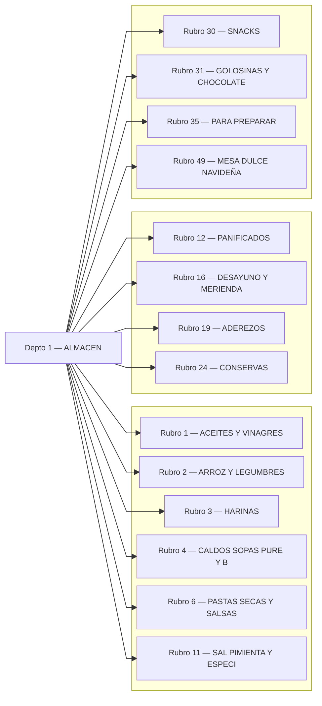

---

## Rubro 1 — ACEITES Y VINAGRES
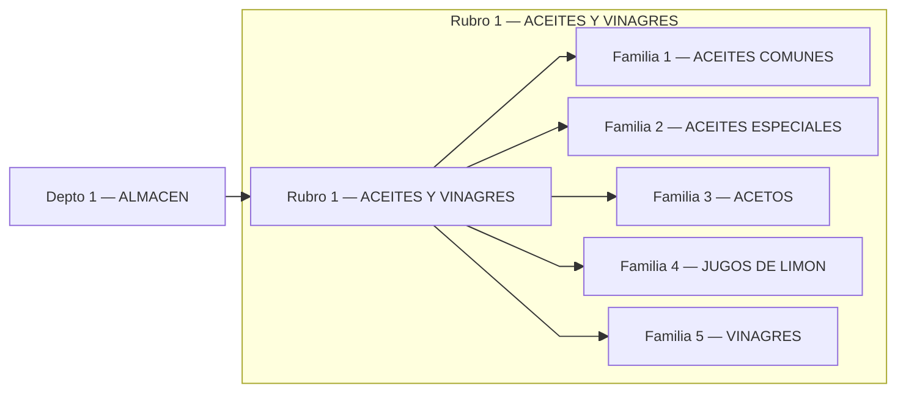

## Rubro 2 — ARROZ Y LEGUMBRES
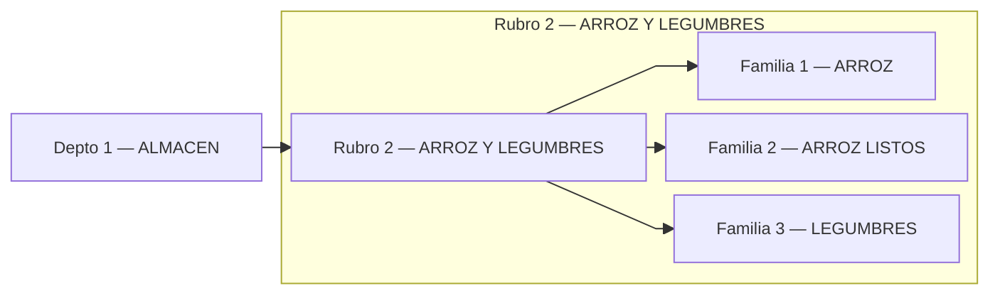

## Rubro 3 — HARINAS
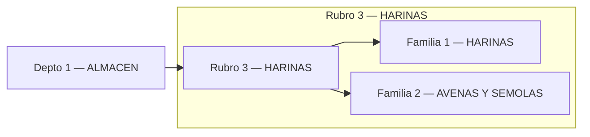

## Rubro 4 — CALDOS SOPAS PURE Y B
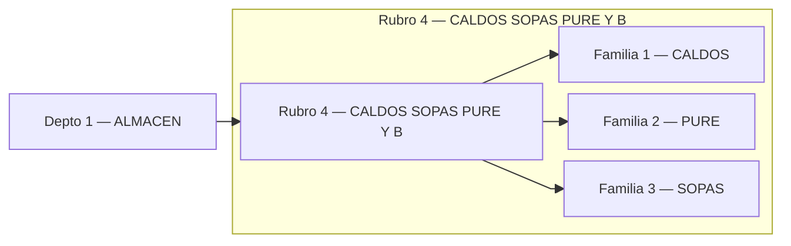

## Rubro 6 — PASTAS SECAS Y SALSAS
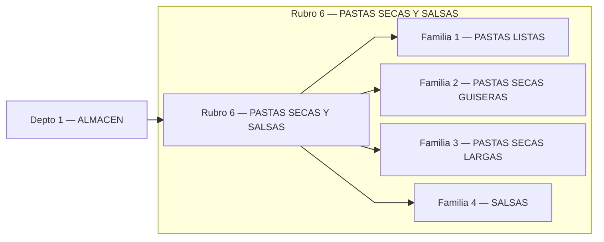

## Rubro 11 — SAL PIMIENTA Y ESPECI
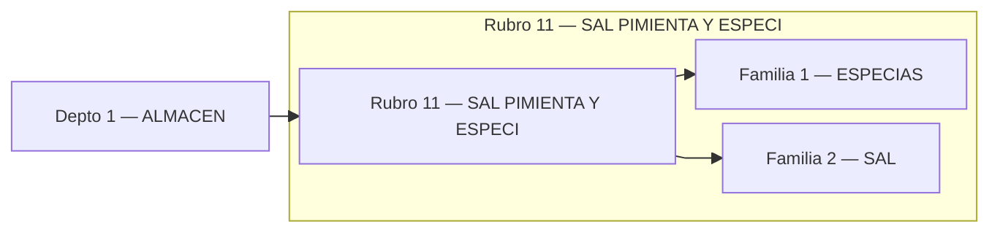

## Rubro 12 — PANIFICADOS
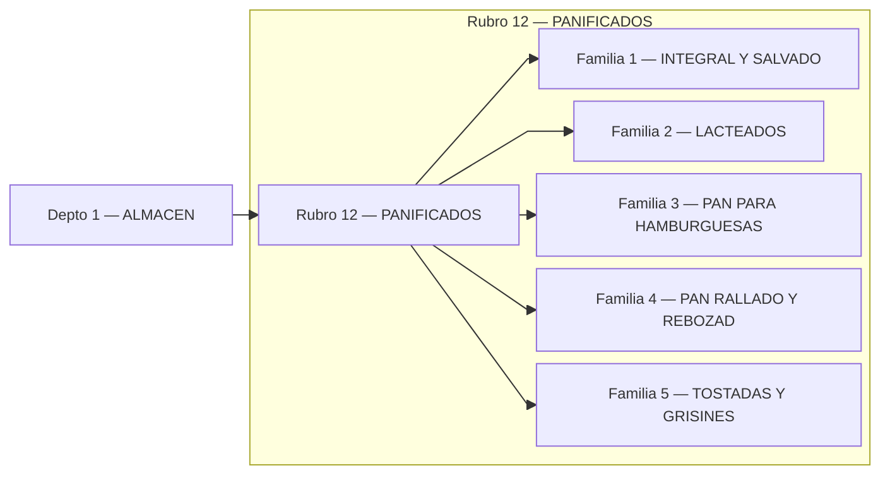

## Rubro 16 — DESAYUNO Y MERIENDA
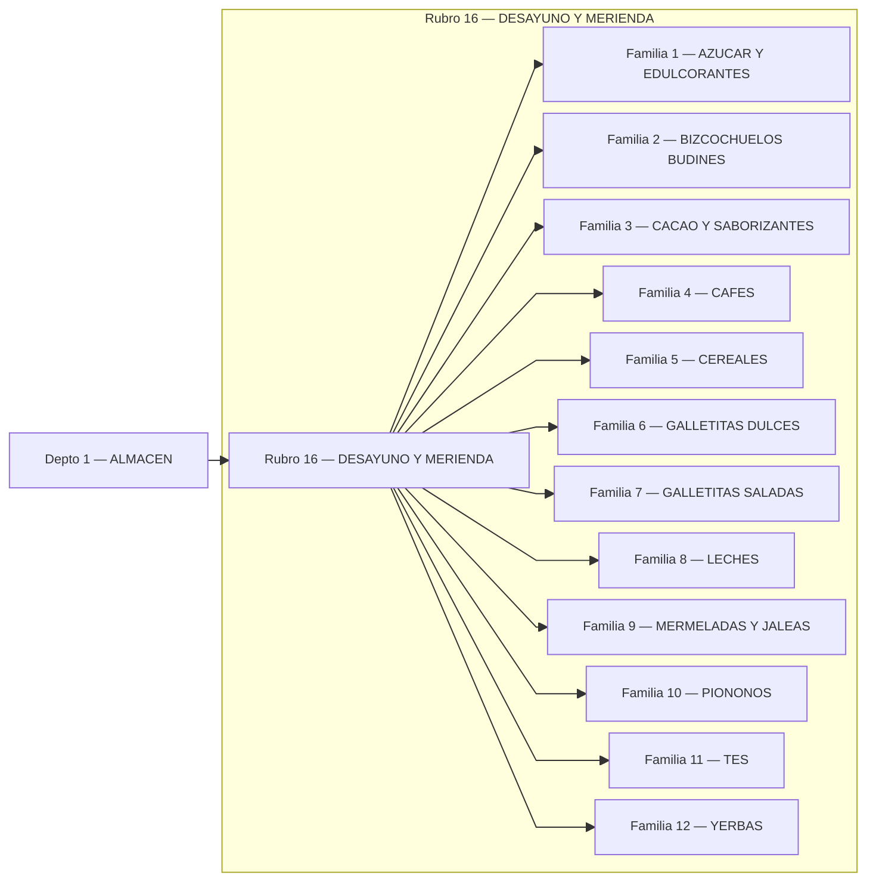

## Rubro 19 — ADEREZOS
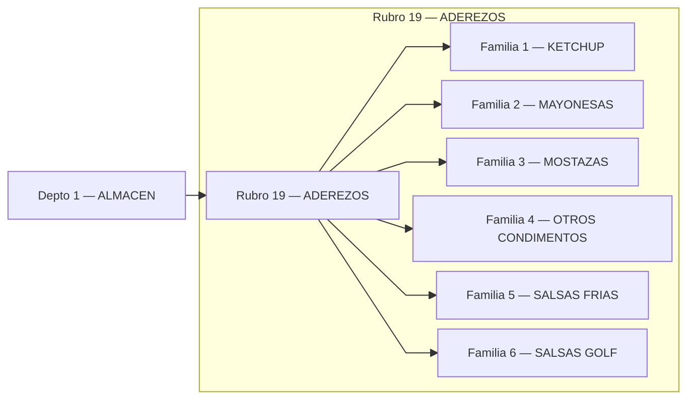

## Rubro 24 — CONSERVAS
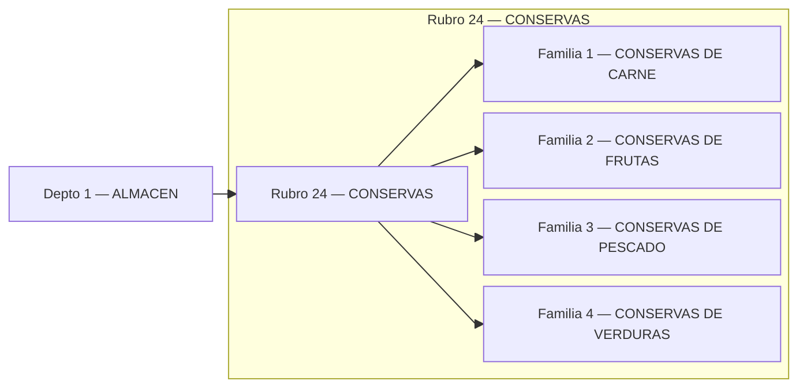

## Rubro 30 — SNACKS
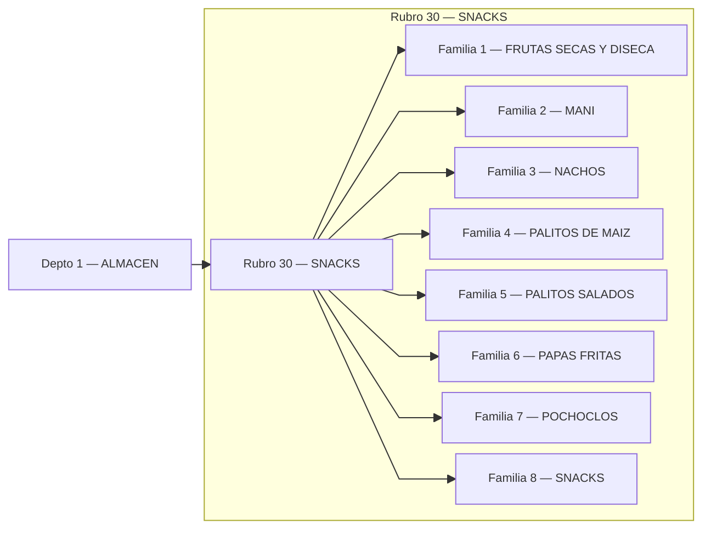

## Rubro 31 — GOLOSINAS Y CHOCOLATE
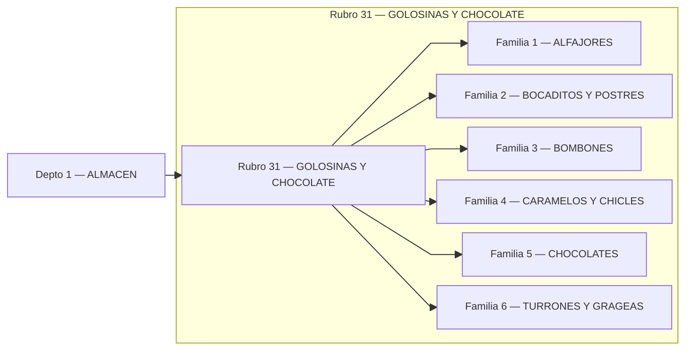

## Rubro 35 — PARA PREPARAR
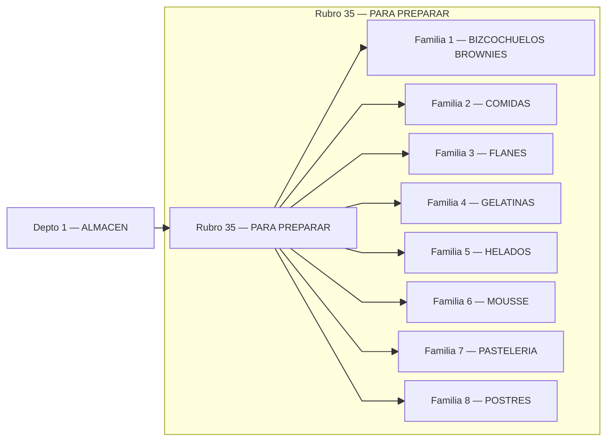

## Rubro 49 — MESA DULCE NAVIDEÑA
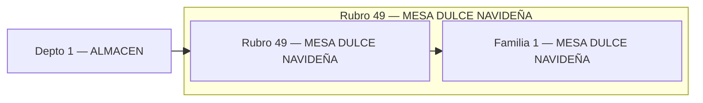
