# Catálogo BEBIDAS

## Índice (Depto → Rubros)
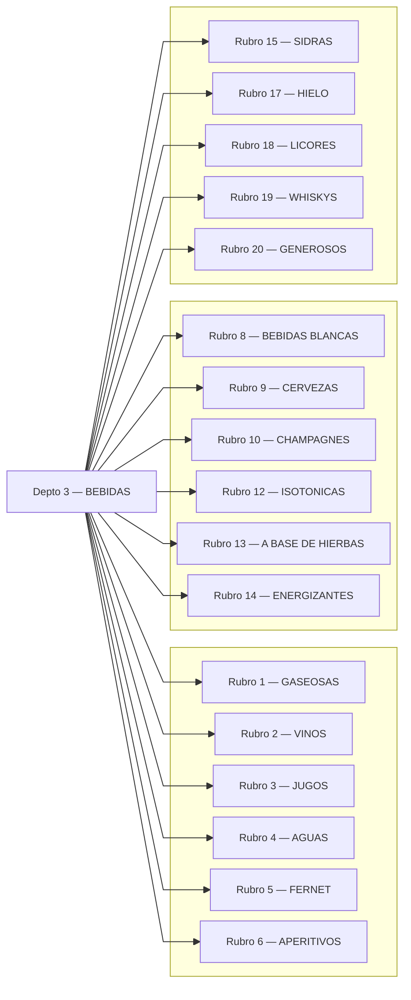

---

## Rubro 1 — GASEOSAS
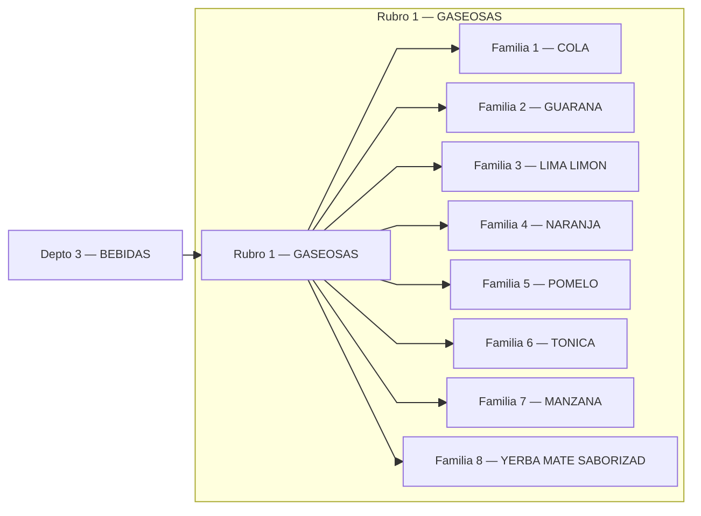

## Rubro 2 — VINOS
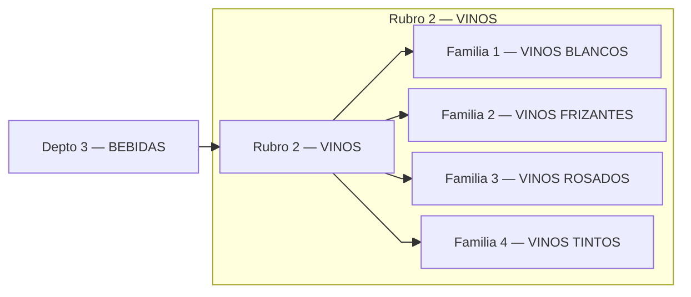

## Rubro 3 — JUGOS
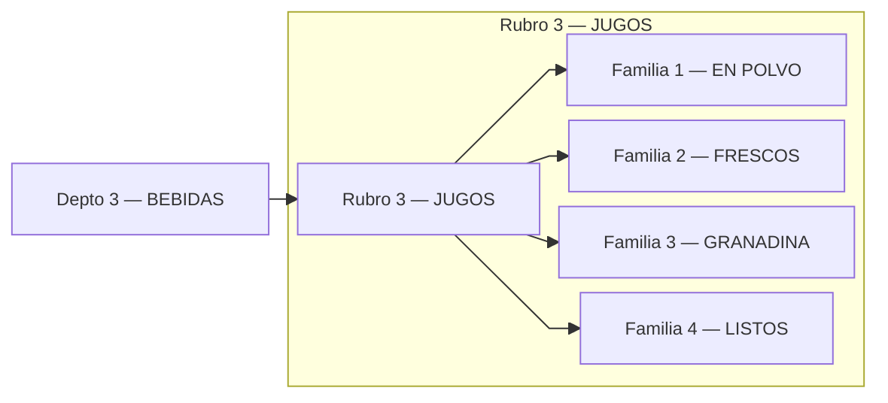

## Rubro 4 — AGUAS
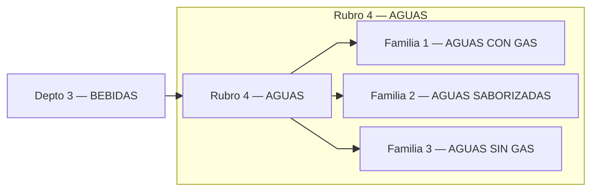

## Rubro 5 — FERNET
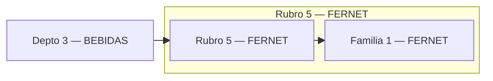

## Rubro 6 — APERITIVOS
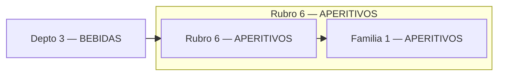

## Rubro 8 — BEBIDAS BLANCAS
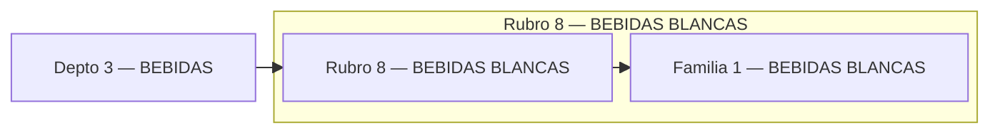

## Rubro 9 — CERVEZAS
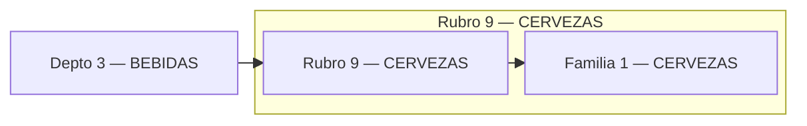

## Rubro 10 — CHAMPAGNES
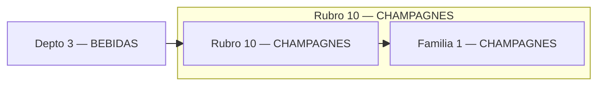

## Rubro 12 — ISOTONICAS
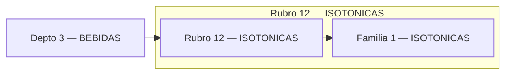

## Rubro 13 — A BASE DE HIERBAS
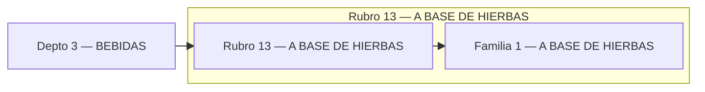

## Rubro 14 — ENERGIZANTES
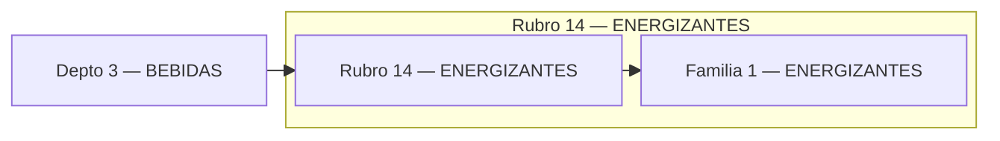

## Rubro 15 — SIDRAS
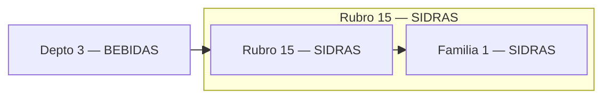

## Rubro 17 — HIELO
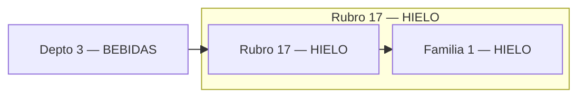

## Rubro 18 — LICORES
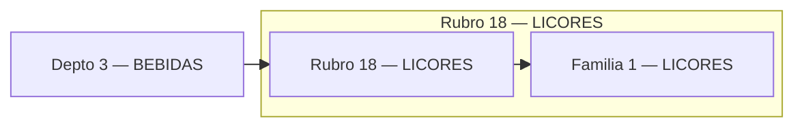

## Rubro 19 — WHISKYS
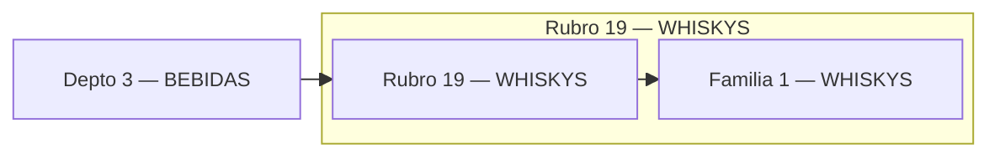

## Rubro 20 — GENEROSOS

