# Catálogo LIMPIEZA

## Índice (Depto → Rubros)
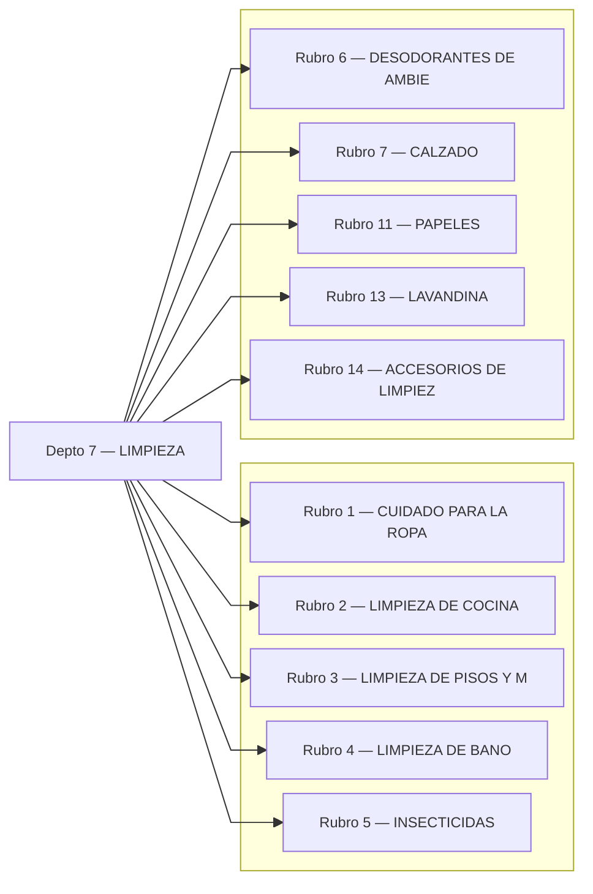

---

## Rubro 1 — CUIDADO PARA LA ROPA
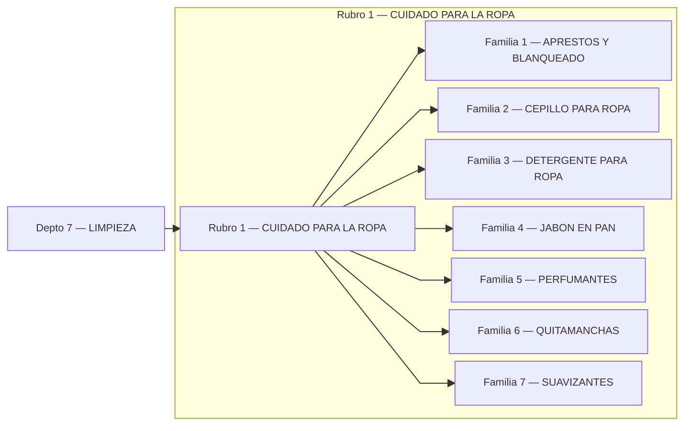

## Rubro 2 — LIMPIEZA DE COCINA
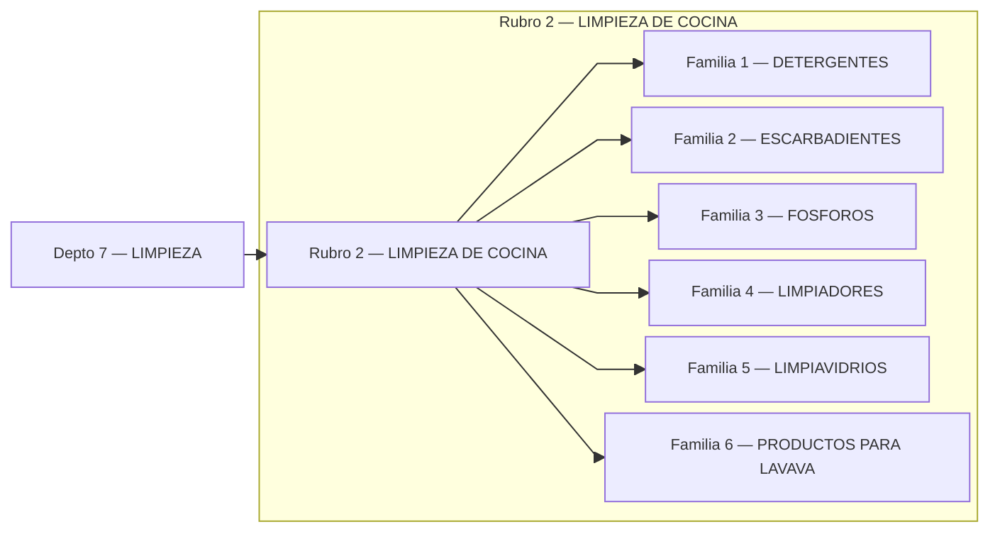

## Rubro 3 — LIMPIEZA DE PISOS Y M
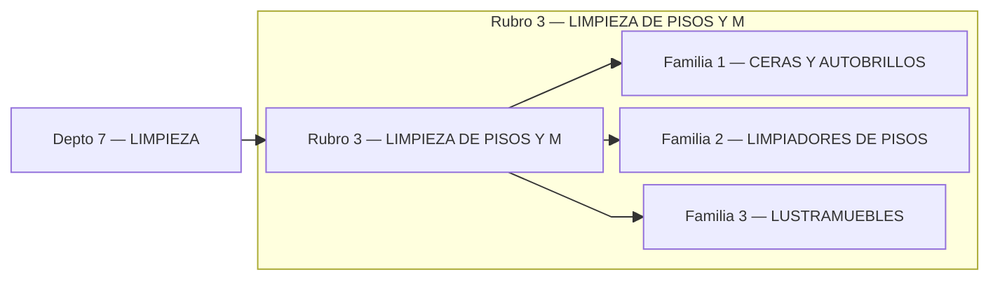

## Rubro 4 — LIMPIEZA DE BANO
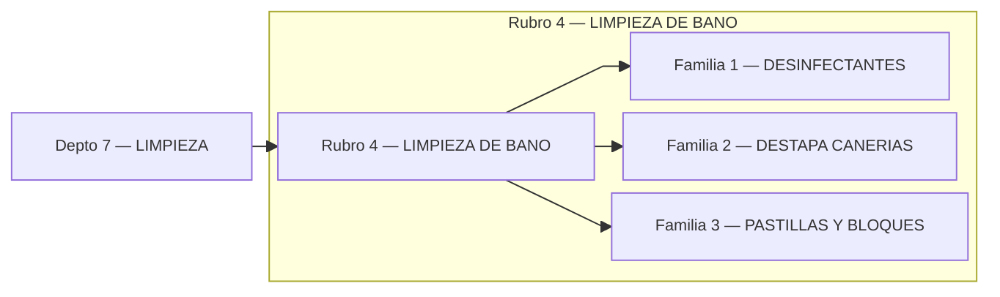

## Rubro 5 — INSECTICIDAS
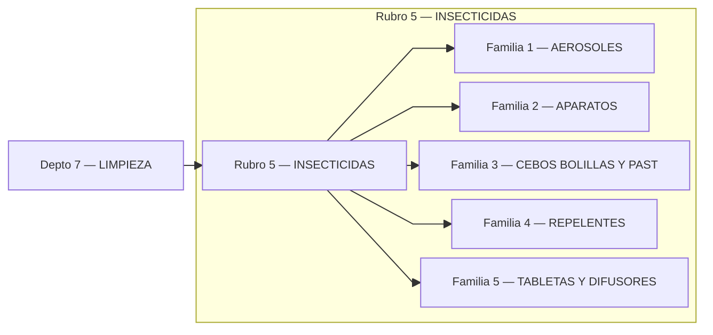

## Rubro 6 — DESODORANTES DE AMBIE
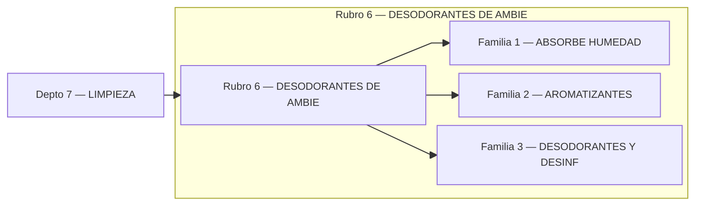

## Rubro 7 — CALZADO
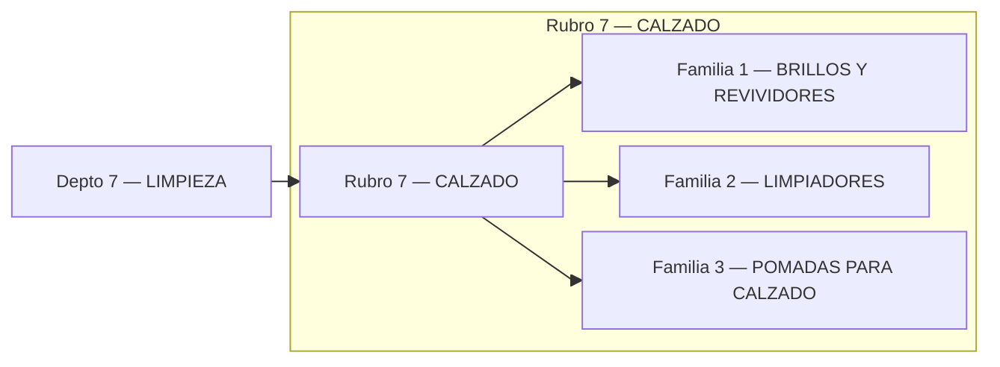

## Rubro 11 — PAPELES
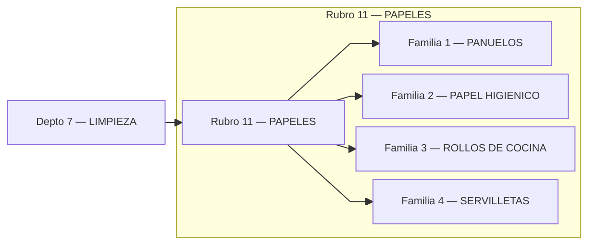

## Rubro 13 — LAVANDINA
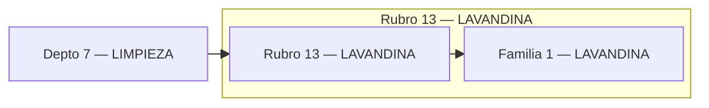

## Rubro 14 — ACCESORIOS DE LIMPIEZ
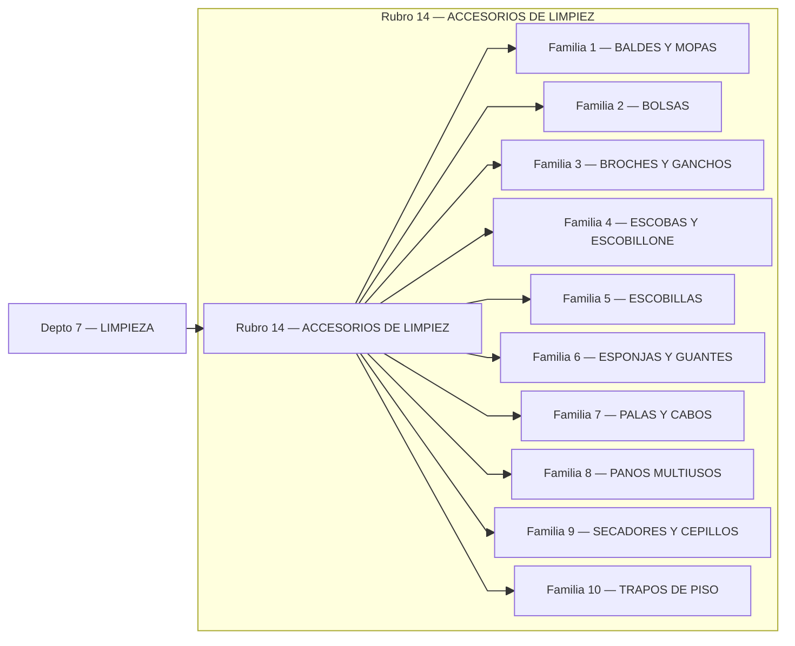
