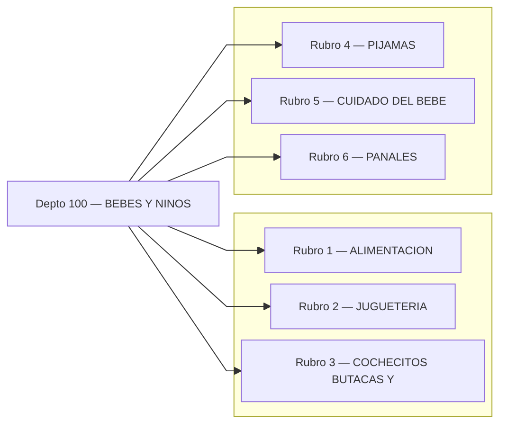
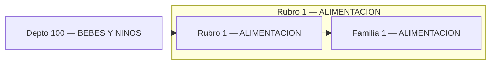
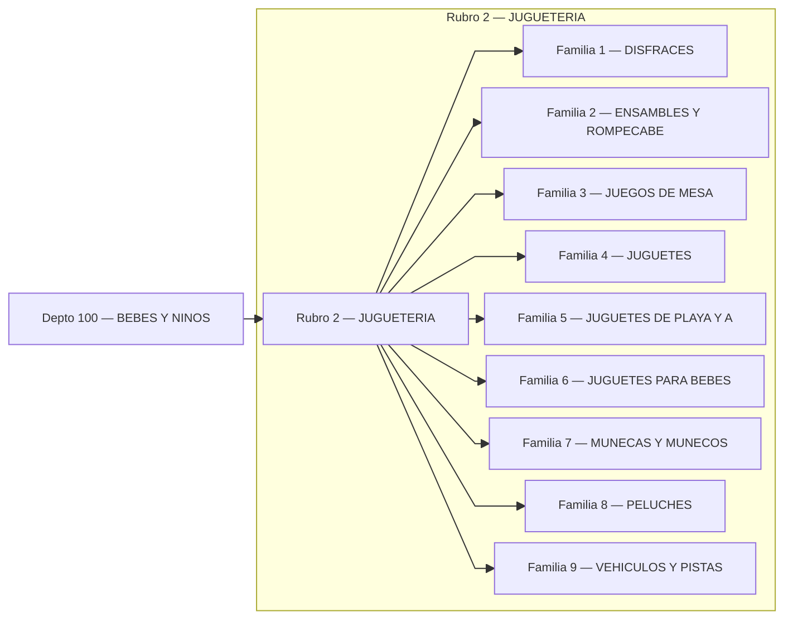
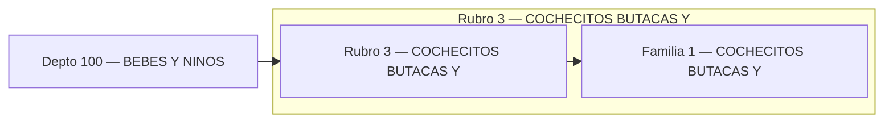
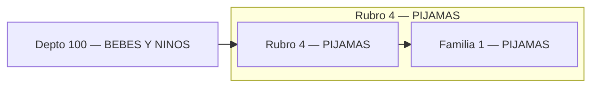
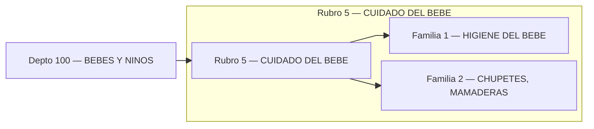
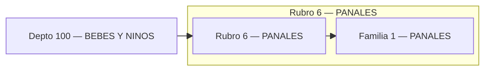

# Catálogo BEBES Y NINOS
## Índice (Depto → Rubros)

---

## Rubro 1 — ALIMENTACION

## Rubro 2 — JUGUETERIA

## Rubro 3 — COCHECITOS BUTACAS Y

## Rubro 4 — PIJAMAS

## Rubro 5 — CUIDADO DEL BEBE

## Rubro 6 — PANALES

