# Catálogo CARNES

## Índice (Depto → Rubros)
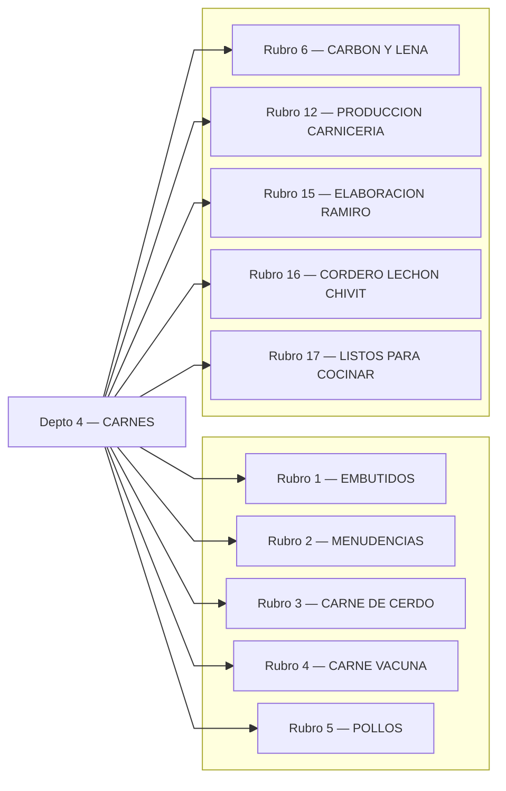

---

## Rubro 1 — EMBUTIDOS
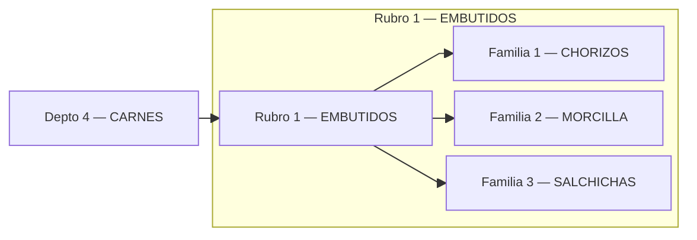

## Rubro 2 — MENUDENCIAS
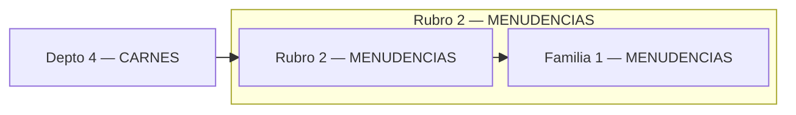

## Rubro 3 — CARNE DE CERDO
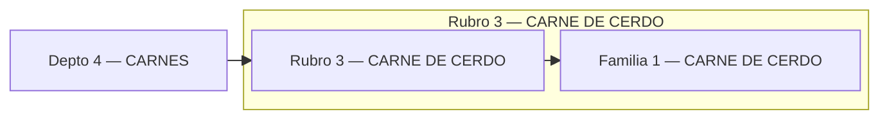

## Rubro 4 — CARNE VACUNA
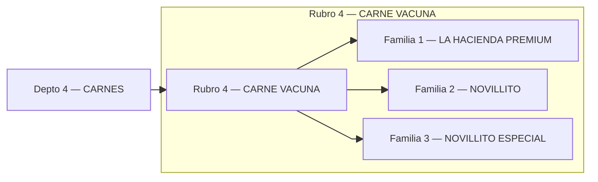

## Rubro 5 — POLLOS
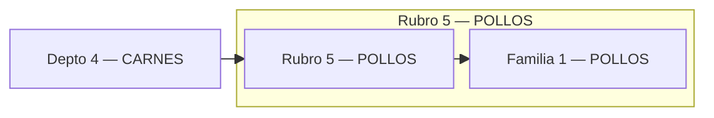

## Rubro 6 — CARBON Y LENA
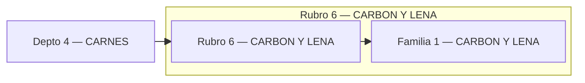

## Rubro 12 — PRODUCCION CARNICERIA
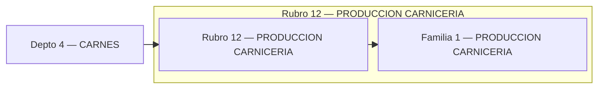

## Rubro 15 — ELABORACION RAMIRO
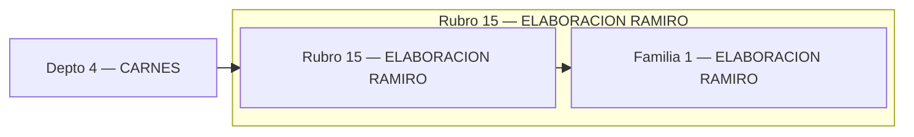

## Rubro 16 — CORDERO LECHON CHIVIT
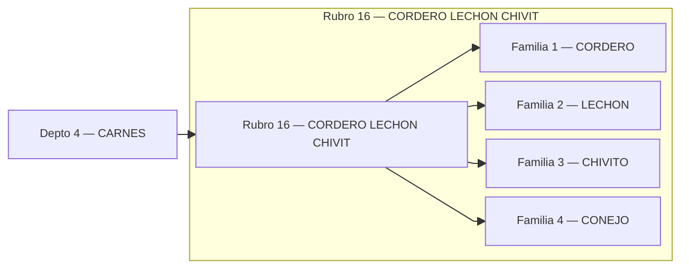

## Rubro 17 — LISTOS PARA COCINAR
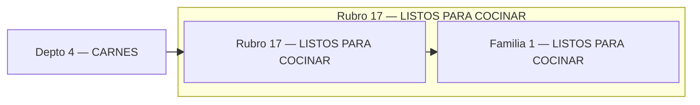
