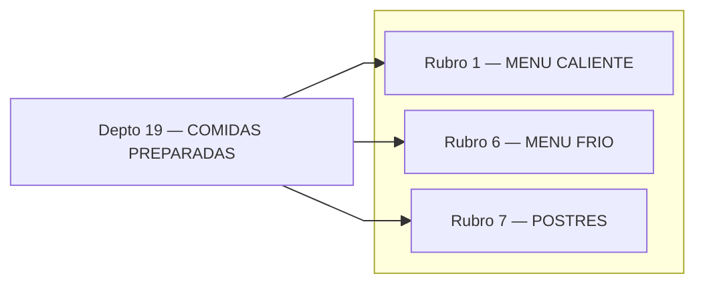
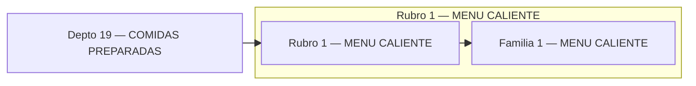
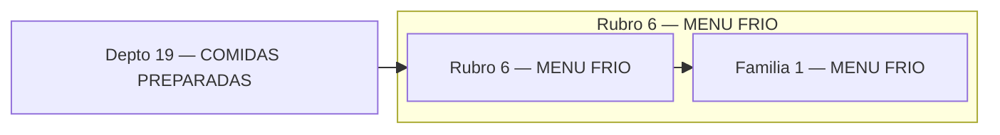
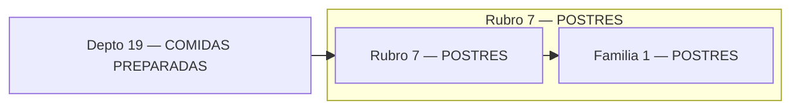

# Catálogo COMIDAS PREPARADAS
## Índice (Depto → Rubros)

```mermaid
%% Vista horizontal estilo A4 (índice)
%% Ajustes de densidad para caber en A4
%%{init: {'flowchart': {'htmlLabels': true, 'curve': 'linear', 'nodeSpacing': 12, 'rankSpacing': 16}, 'themeVariables': {'fontSize': '12px'}}}%%
flowchart LR
  D19["Depto 19 — COMIDAS PREPARADAS"]

  %% Fila 1
  subgraph Row1[ ]
    direction LR
    R1["Rubro 1 — MENU CALIENTE"]
    R6["Rubro 6 — MENU FRIO"]
    R7["Rubro 7 — POSTRES"]
  end

  %% Enlaces del Depto a cada Rubro
  D19 --> R1 & R6 & R7
```

---

## Rubro 1 — MENU CALIENTE

```mermaid
%%{init: {'flowchart': {'htmlLabels': true, 'curve': 'linear', 'nodeSpacing': 10, 'rankSpacing': 14}, 'themeVariables': {'fontSize': '12px'}}}%%
flowchart LR
  D19["Depto 19 — COMIDAS PREPARADAS"]
  subgraph G_R1["Rubro 1 — MENU CALIENTE"]
    direction TB
    R1["Rubro 1 — MENU CALIENTE"]
    R1 --> F1_1["Familia 1 — MENU CALIENTE"]
  end
  D19 --> R1
```

## Rubro 6 — MENU FRIO

```mermaid
%%{init: {'flowchart': {'htmlLabels': true, 'curve': 'linear', 'nodeSpacing': 10, 'rankSpacing': 14}, 'themeVariables': {'fontSize': '12px'}}}%%
flowchart LR
  D19["Depto 19 — COMIDAS PREPARADAS"]
  subgraph G_R6["Rubro 6 — MENU FRIO"]
    direction TB
    R6["Rubro 6 — MENU FRIO"]
    R6 --> F6_1["Familia 1 — MENU FRIO"]
  end
  D19 --> R6
```

## Rubro 7 — POSTRES

```mermaid
%%{init: {'flowchart': {'htmlLabels': true, 'curve': 'linear', 'nodeSpacing': 10, 'rankSpacing': 14}, 'themeVariables': {'fontSize': '12px'}}}%%
flowchart LR
  D19["Depto 19 — COMIDAS PREPARADAS"]
  subgraph G_R7["Rubro 7 — POSTRES"]
    direction TB
    R7["Rubro 7 — POSTRES"]
    R7 --> F7_1["Familia 1 — POSTRES"]
  end
  D19 --> R7
```
