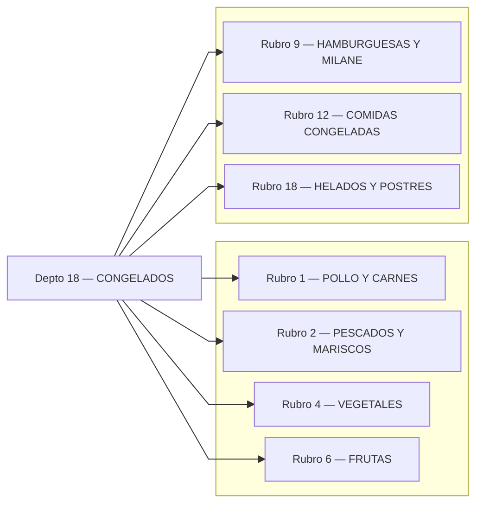
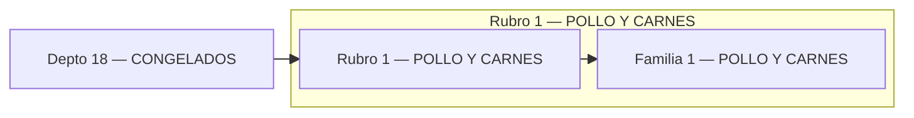
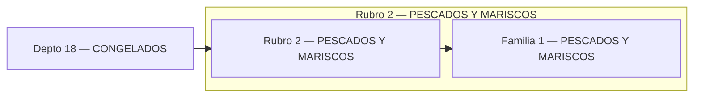
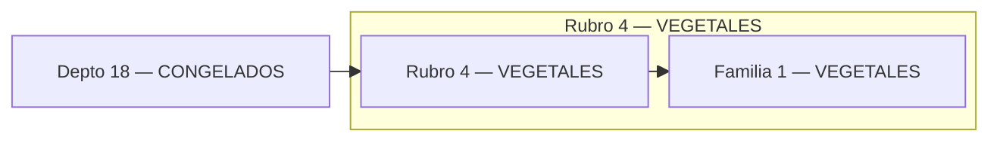
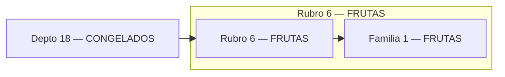
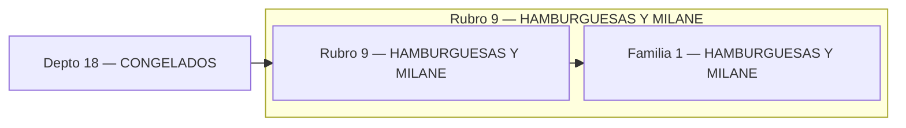
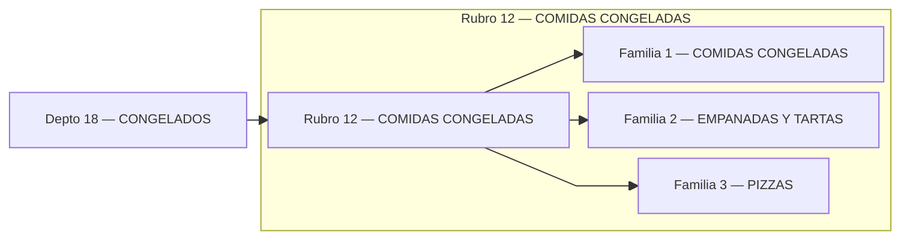
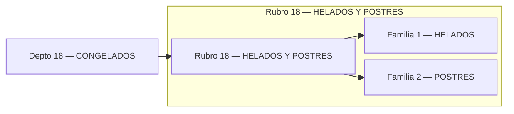

# Catálogo CONGELADOS

## Índice (Depto → Rubros)

---

## Rubro 1 — POLLO Y CARNES

## Rubro 2 — PESCADOS Y MARISCOS

## Rubro 4 — VEGETALES

## Rubro 6 — FRUTAS

## Rubro 9 — HAMBURGUESAS Y MILANE

## Rubro 12 — COMIDAS CONGELADAS

## Rubro 18 — HELADOS Y POSTRES

