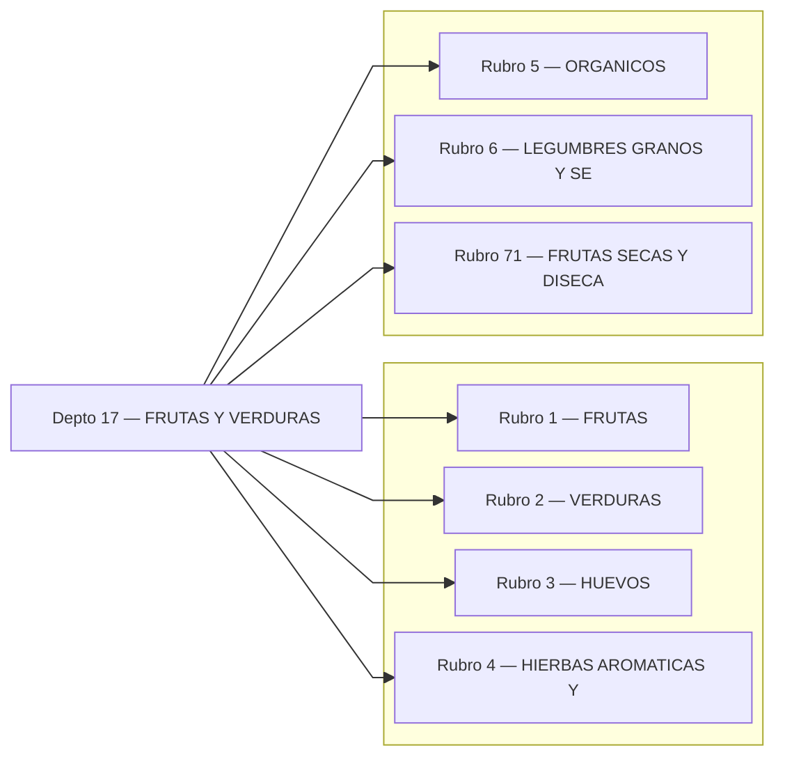
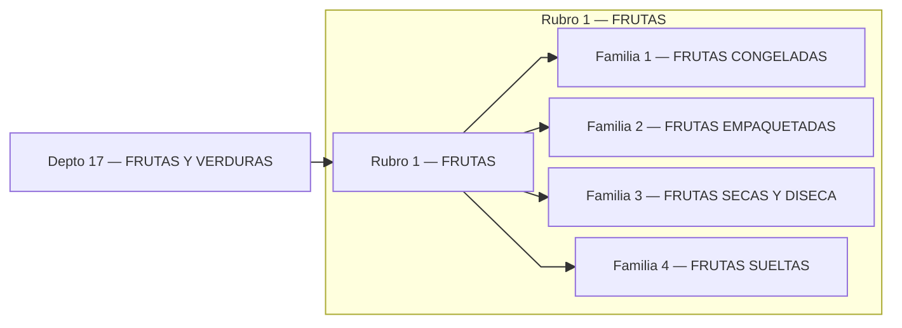
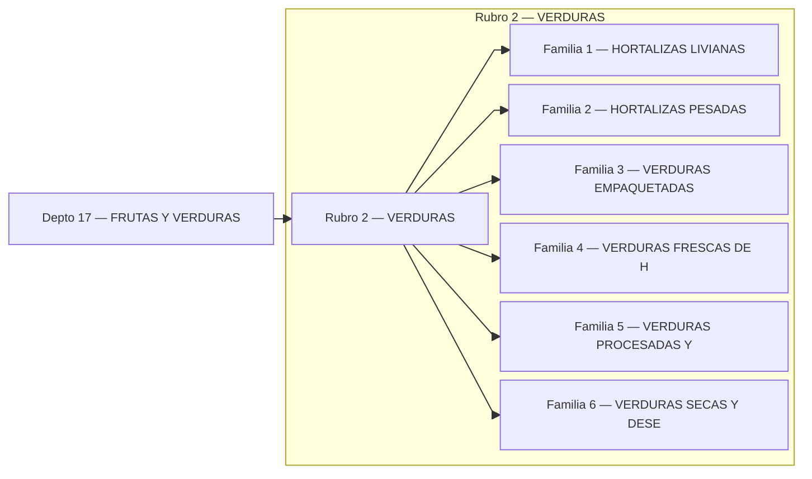
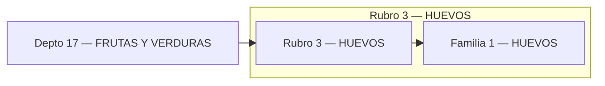
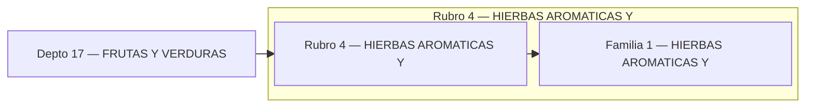
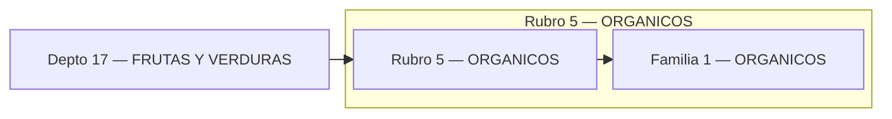
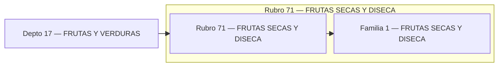

# Catálogo FRUTAS Y VERDURAS
## Índice (Depto → Rubros)

---

## Rubro 1 — FRUTAS

## Rubro 2 — VERDURAS

## Rubro 3 — HUEVOS

## Rubro 4 — HIERBAS AROMATICAS Y

## Rubro 5 — ORGANICOS

## Rubro 6 — LEGUMBRES GRANOS Y SE

## Rubro 71 — FRUTAS SECAS Y DISECA

