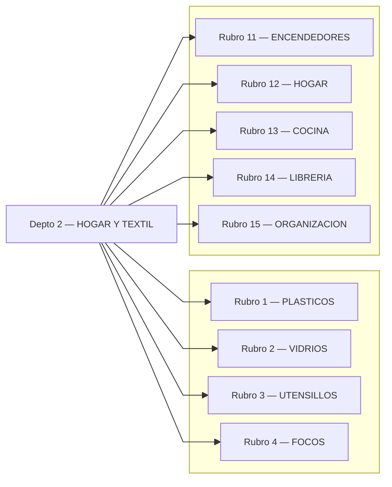
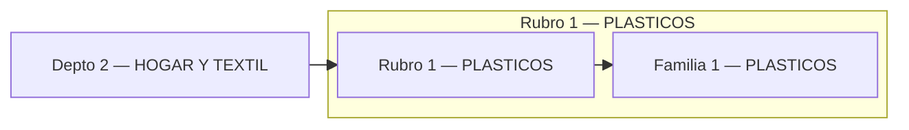
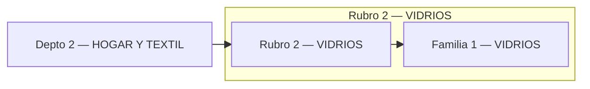
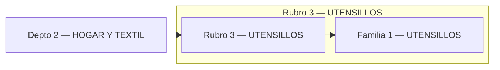
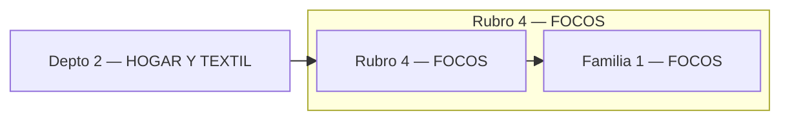
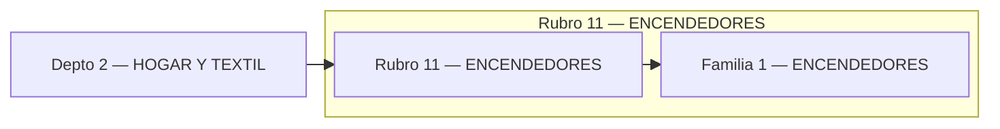
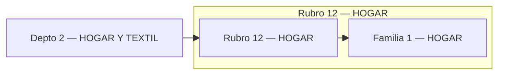
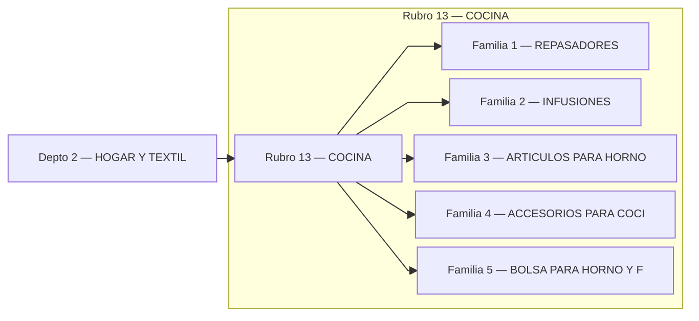
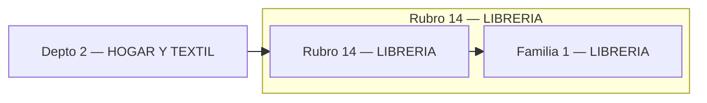
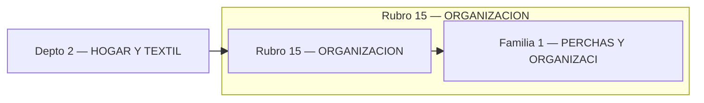

# Catálogo HOGAR Y TEXTIL

## Índice (Depto → Rubros)

---

## Rubro 1 — PLASTICOS

## Rubro 2 — VIDRIOS

## Rubro 3 — UTENSILLOS

## Rubro 4 — FOCOS

## Rubro 11 — ENCENDEDORES

## Rubro 12 — HOGAR

## Rubro 13 — COCINA

## Rubro 14 — LIBRERIA

## Rubro 15 — ORGANIZACION

