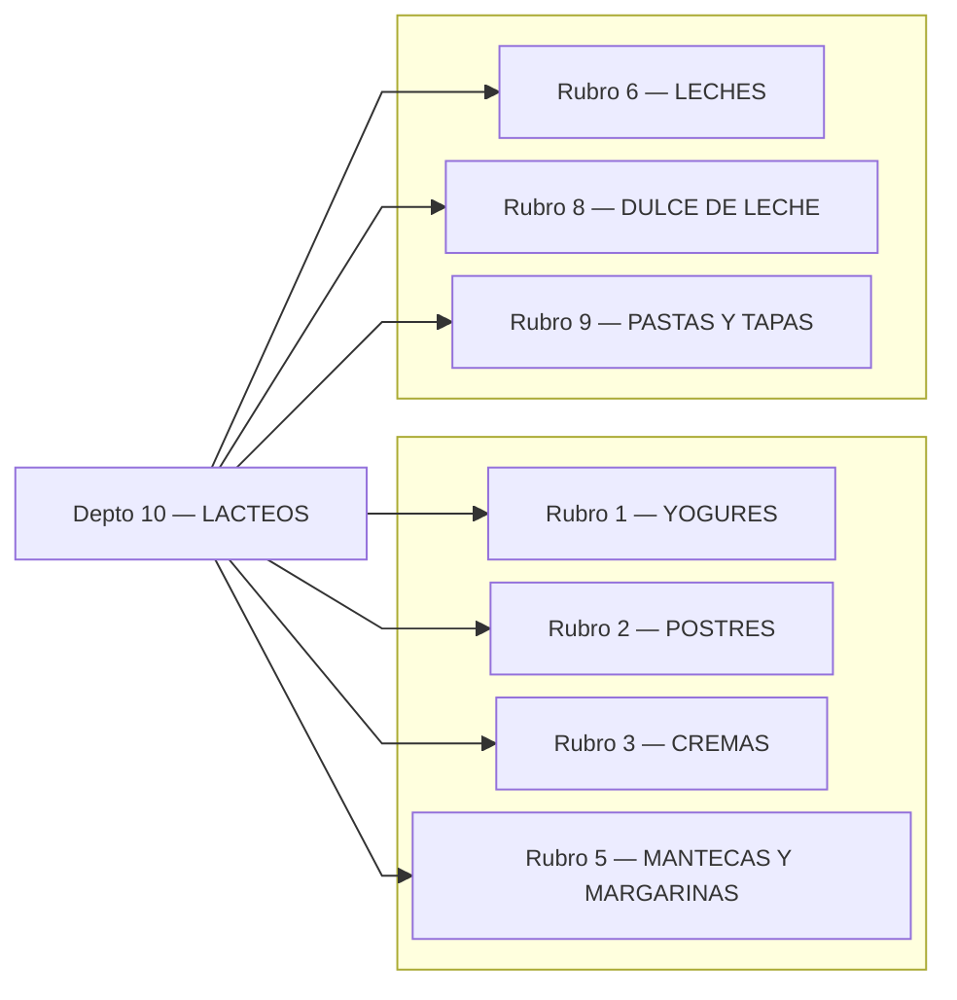
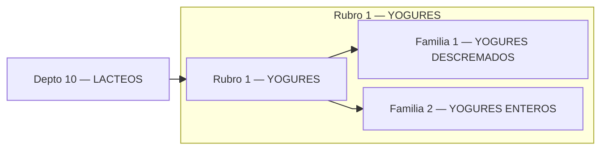
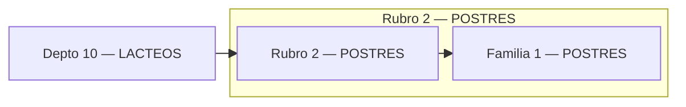
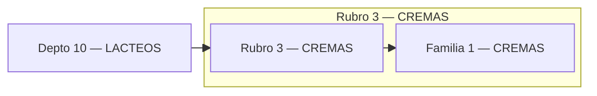
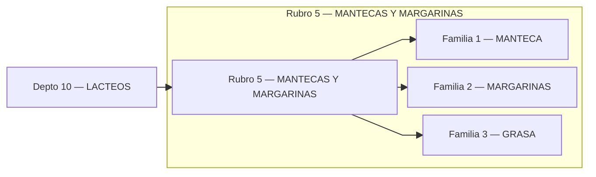
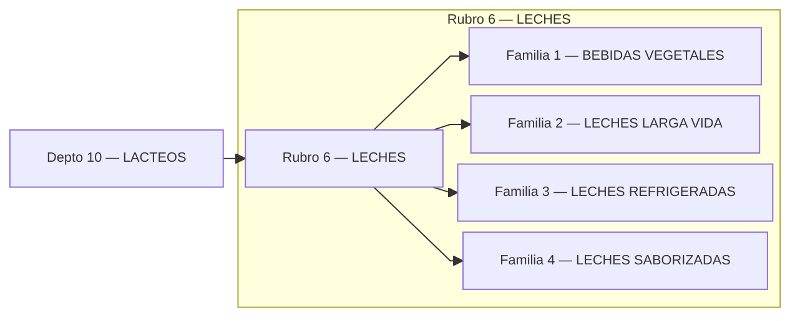
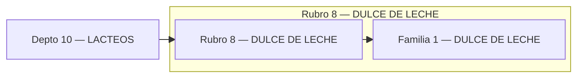
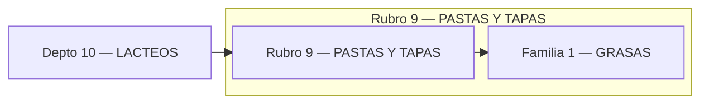

# Catálogo LACTEOS

## Índice (Depto → Rubros)

---

## Rubro 1 — YOGURES

## Rubro 2 — POSTRES

## Rubro 3 — CREMAS

## Rubro 5 — MANTECAS Y MARGARINAS

## Rubro 6 — LECHES

## Rubro 8 — DULCE DE LECHE

## Rubro 9 — PASTAS Y TAPAS

