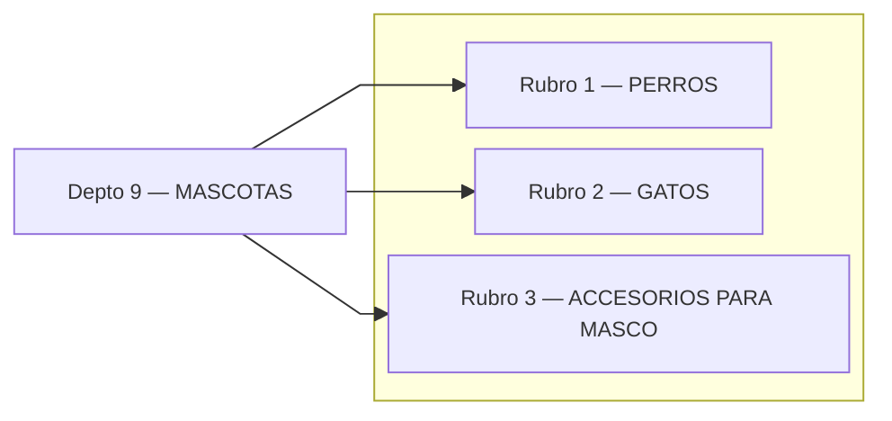
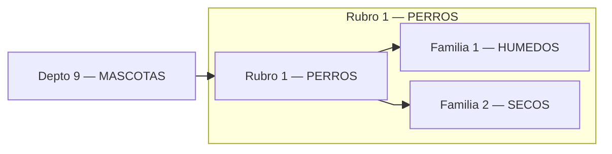
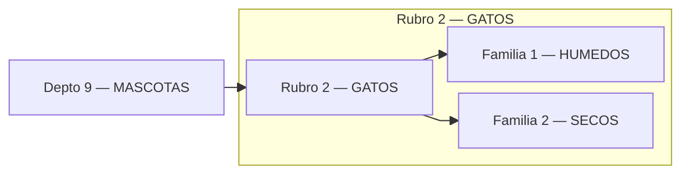
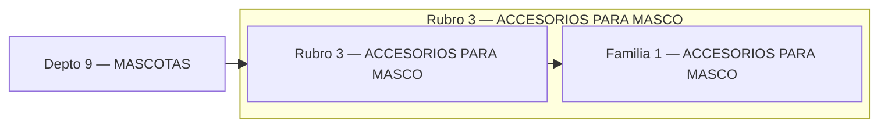

# Catálogo MASCOTAS

## Índice (Depto → Rubros)

```mermaid
%% Vista horizontal estilo A4 (índice)
%% Ajustes de densidad para caber en A4
%%{init: {'flowchart': {'htmlLabels': true, 'curve': 'linear', 'nodeSpacing': 12, 'rankSpacing': 16}, 'themeVariables': {'fontSize': '12px'}}}%%
flowchart LR
  D9["Depto 9 — MASCOTAS"]

  %% Fila 1
  subgraph Row1[ ]
    direction LR
    R1["Rubro 1 — PERROS"]
    R2["Rubro 2 — GATOS"]
    R3["Rubro 3 — ACCESORIOS PARA MASCO"]
  end

  %% Enlaces del Depto a cada Rubro
  D9 --> R1 & R2 & R3
```

---

## Rubro 1 — PERROS

```mermaid
%%{init: {'flowchart': {'htmlLabels': true, 'curve': 'linear', 'nodeSpacing': 10, 'rankSpacing': 13}, 'themeVariables': {'fontSize': '12px'}}}%%
flowchart LR
  D9["Depto 9 — MASCOTAS"]
  subgraph G_R1["Rubro 1 — PERROS"]
    direction TB
    R1["Rubro 1 — PERROS"]
    R1 --> F1_1["Familia 1 — HUMEDOS"]
    R1 --> F1_2["Familia 2 — SECOS"]
  end
  D9 --> R1
```

## Rubro 2 — GATOS

```mermaid
%%{init: {'flowchart': {'htmlLabels': true, 'curve': 'linear', 'nodeSpacing': 10, 'rankSpacing': 13}, 'themeVariables': {'fontSize': '12px'}}}%%
flowchart LR
  D9["Depto 9 — MASCOTAS"]
  subgraph G_R2["Rubro 2 — GATOS"]
    direction TB
    R2["Rubro 2 — GATOS"]
    R2 --> F2_1["Familia 1 — HUMEDOS"]
    R2 --> F2_2["Familia 2 — SECOS"]
  end
  D9 --> R2
```

## Rubro 3 — ACCESORIOS PARA MASCO

```mermaid
%%{init: {'flowchart': {'htmlLabels': true, 'curve': 'linear', 'nodeSpacing': 10, 'rankSpacing': 13}, 'themeVariables': {'fontSize': '12px'}}}%%
flowchart LR
  D9["Depto 9 — MASCOTAS"]
  subgraph G_R3["Rubro 3 — ACCESORIOS PARA MASCO"]
    direction TB
    R3["Rubro 3 — ACCESORIOS PARA MASCO"]
    R3 --> F3_1["Familia 1 — ACCESORIOS PARA MASCO"]
  end
  D9 --> R3
```
