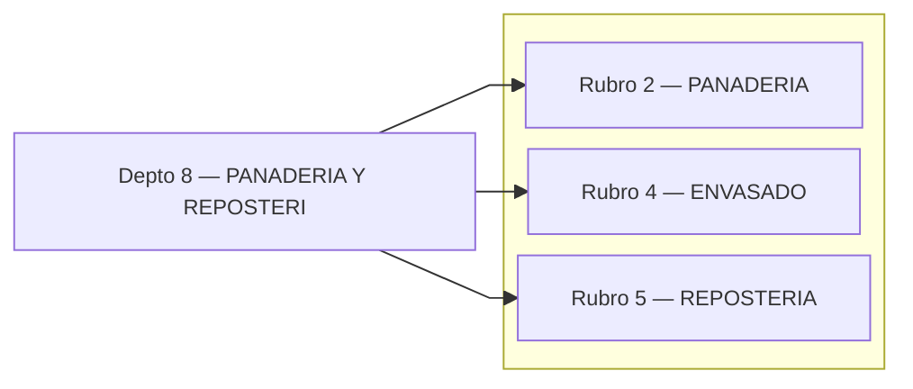
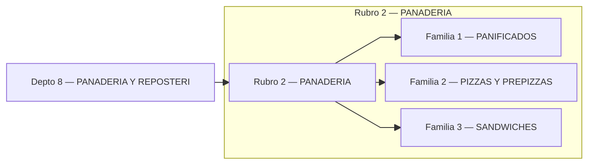
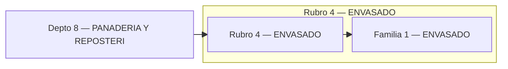
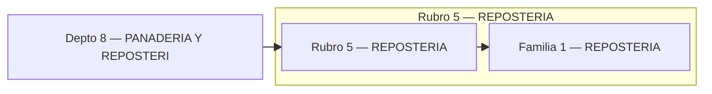

# Catálogo PANADERIA Y REPOSTERIA

## Índice (Depto → Rubros)

```mermaid
%% Vista horizontal estilo A4 (índice)
%% Ajustes de densidad para caber en A4
%%{init: {'flowchart': {'htmlLabels': true, 'curve': 'linear', 'nodeSpacing': 12, 'rankSpacing': 16}, 'themeVariables': {'fontSize': '12px'}}}%%
flowchart LR
  D8["Depto 8 — PANADERIA Y REPOSTERI"]

  %% Fila 1
  subgraph Row1[ ]
    direction LR
    R2["Rubro 2 — PANADERIA"]
    R4["Rubro 4 — ENVASADO"]
    R5["Rubro 5 — REPOSTERIA"]
  end

  %% Enlaces del Depto a cada Rubro
  D8 --> R2 & R4 & R5
```

---

## Rubro 2 — PANADERIA

```mermaid
%%{init: {'flowchart': {'htmlLabels': true, 'curve': 'linear', 'nodeSpacing': 9, 'rankSpacing': 12}, 'themeVariables': {'fontSize': '11px'}}}%%
flowchart LR
  D8["Depto 8 — PANADERIA Y REPOSTERI"]
  subgraph G_R2["Rubro 2 — PANADERIA"]
    direction TB
    R2["Rubro 2 — PANADERIA"]
    R2 --> F2_1["Familia 1 — PANIFICADOS"]
    R2 --> F2_2["Familia 2 — PIZZAS Y PREPIZZAS"]
    R2 --> F2_3["Familia 3 — SANDWICHES"]
  end
  D8 --> R2
```

## Rubro 4 — ENVASADO

```mermaid
%%{init: {'flowchart': {'htmlLabels': true, 'curve': 'linear', 'nodeSpacing': 10, 'rankSpacing': 13}, 'themeVariables': {'fontSize': '12px'}}}%%
flowchart LR
  D8["Depto 8 — PANADERIA Y REPOSTERI"]
  subgraph G_R4["Rubro 4 — ENVASADO"]
    direction TB
    R4["Rubro 4 — ENVASADO"]
    R4 --> F4_1["Familia 1 — ENVASADO"]
  end
  D8 --> R4
```

## Rubro 5 — REPOSTERIA

```mermaid
%%{init: {'flowchart': {'htmlLabels': true, 'curve': 'linear', 'nodeSpacing': 10, 'rankSpacing': 13}, 'themeVariables': {'fontSize': '12px'}}}%%
flowchart LR
  D8["Depto 8 — PANADERIA Y REPOSTERI"]
  subgraph G_R5["Rubro 5 — REPOSTERIA"]
    direction TB
    R5["Rubro 5 — REPOSTERIA"]
    R5 --> F5_1["Familia 1 — REPOSTERIA"]
  end
  D8 --> R5
```
