# Catálogo PASTAS FRESCAS

## Índice (Depto → Rubros)
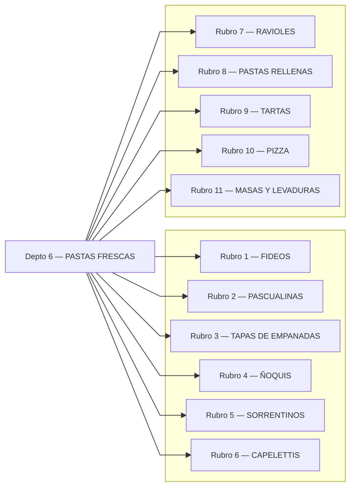

---

## Rubro 1 — FIDEOS
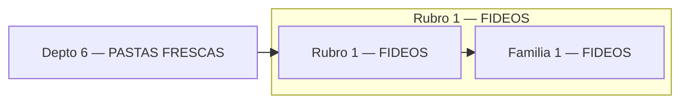

## Rubro 2 — PASCUALINAS
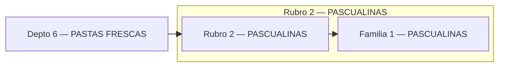

## Rubro 3 — TAPAS DE EMPANADAS
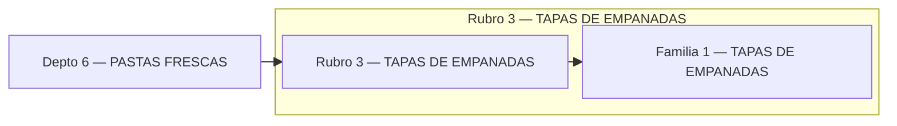

## Rubro 4 — ÑOQUIS
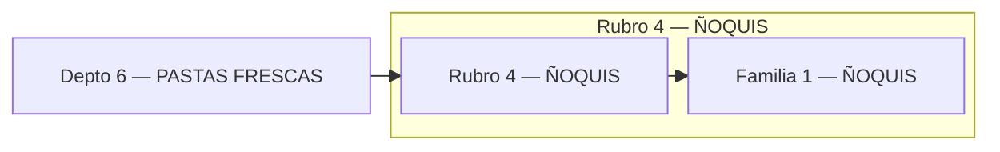

## Rubro 5 — SORRENTINOS
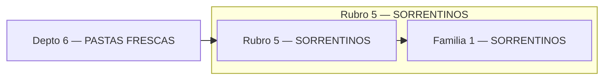

## Rubro 6 — CAPELETTIS
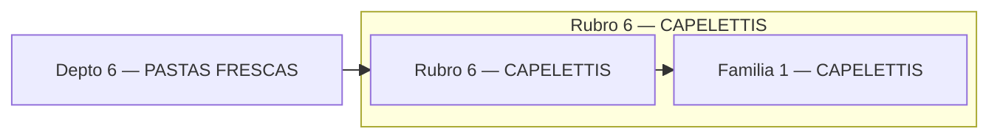

## Rubro 7 — RAVIOLES
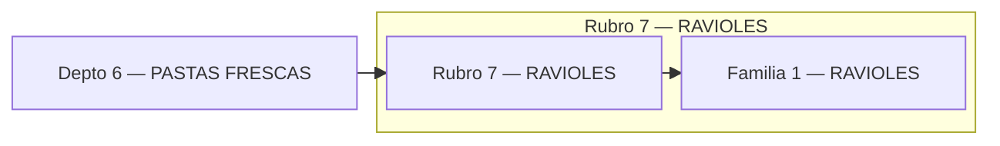

## Rubro 8 — PASTAS RELLENAS
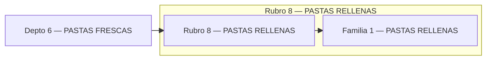

## Rubro 9 — TARTAS

## Rubro 10 — PIZZA
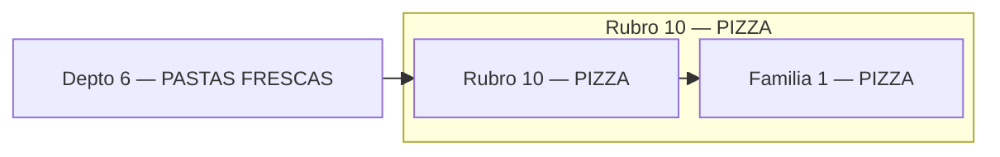

## Rubro 11 — MASAS Y LEVADURAS
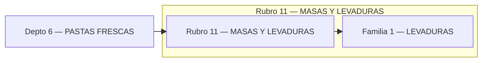
