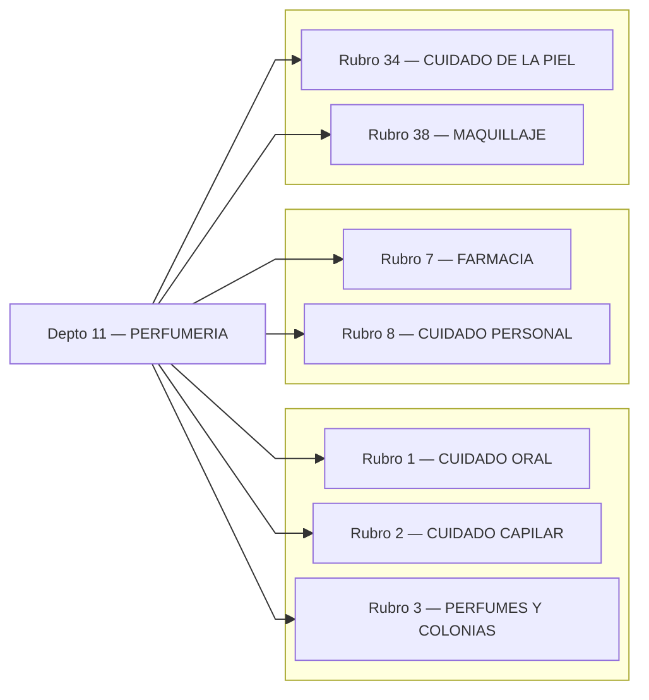
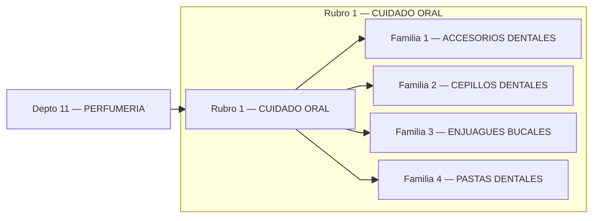
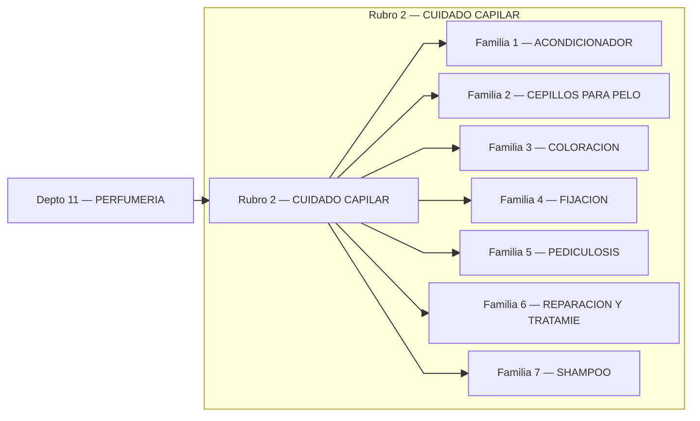
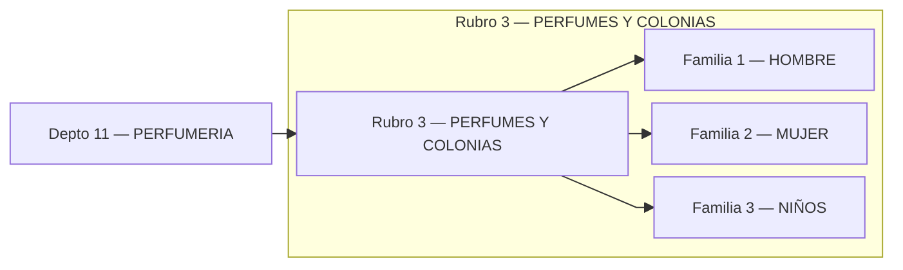
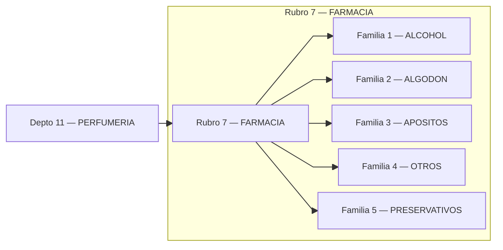
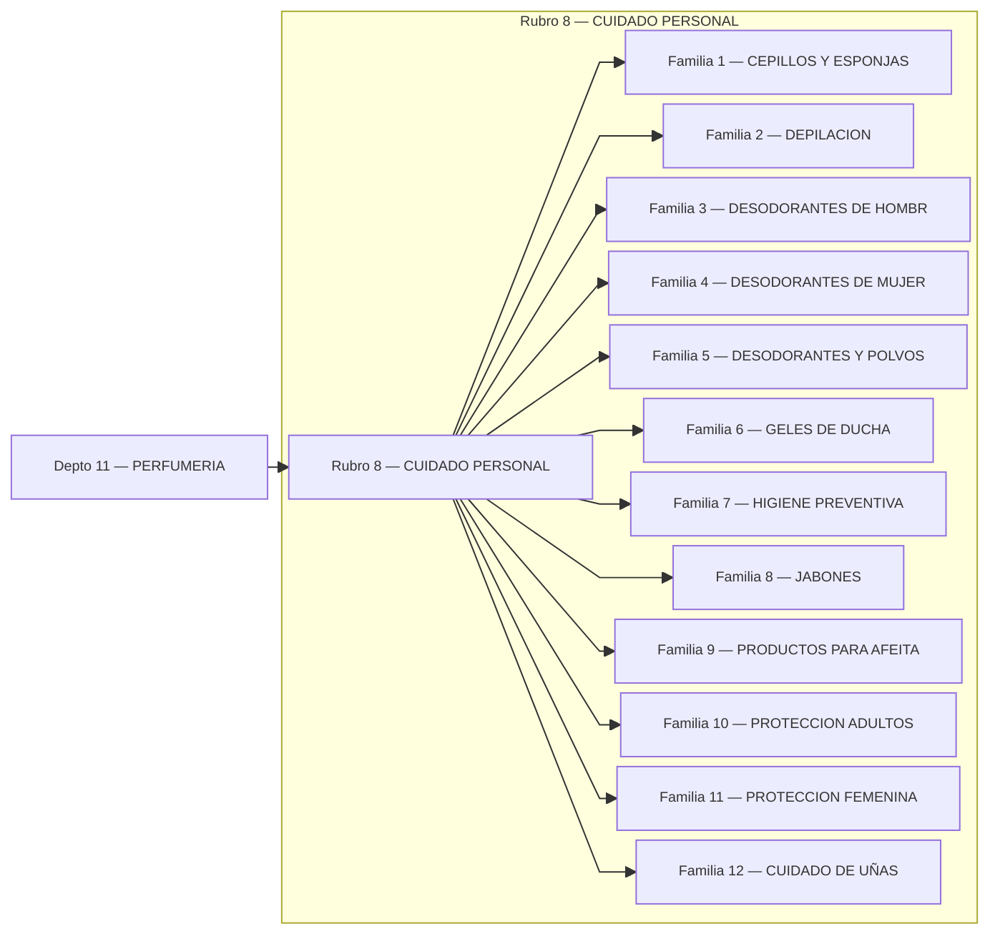
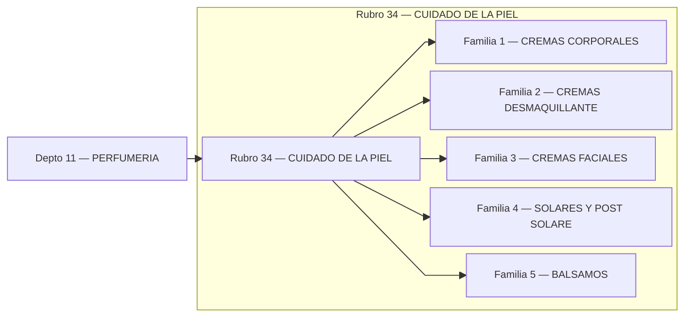

# Catálogo PERFUMERIA

## Índice (Depto → Rubros)

---

## Rubro 1 — CUIDADO ORAL

## Rubro 2 — CUIDADO CAPILAR

## Rubro 3 — PERFUMES Y COLONIAS

## Rubro 7 — FARMACIA

## Rubro 8 — CUIDADO PERSONAL

## Rubro 34 — CUIDADO DE LA PIEL

## Rubro 38 — MAQUILLAJE

