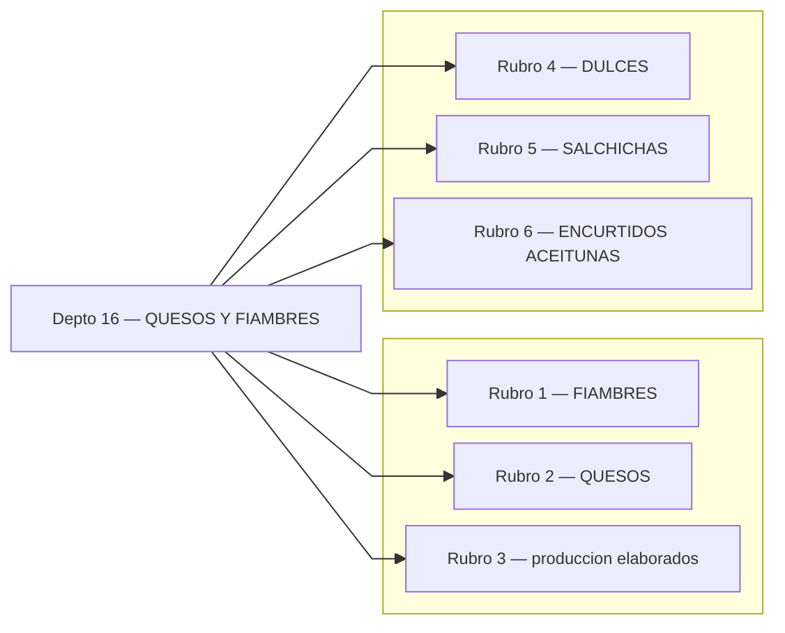
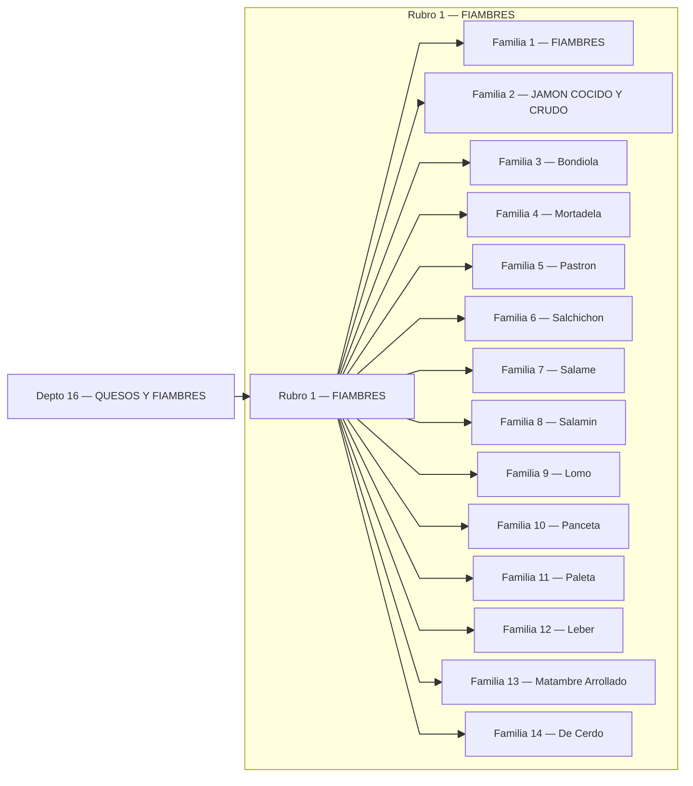
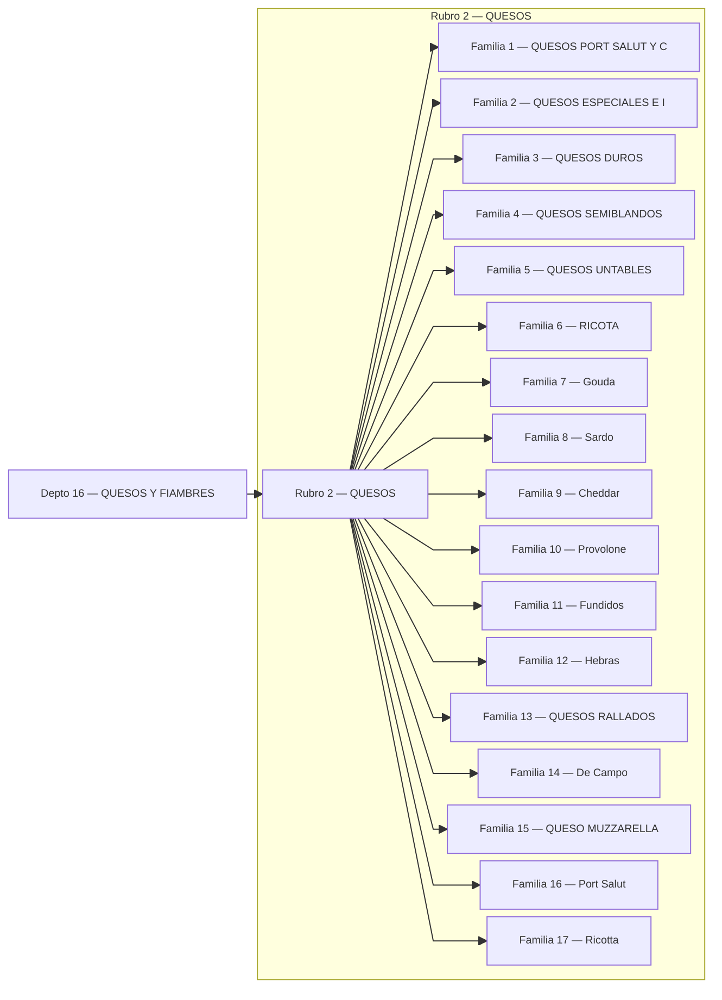
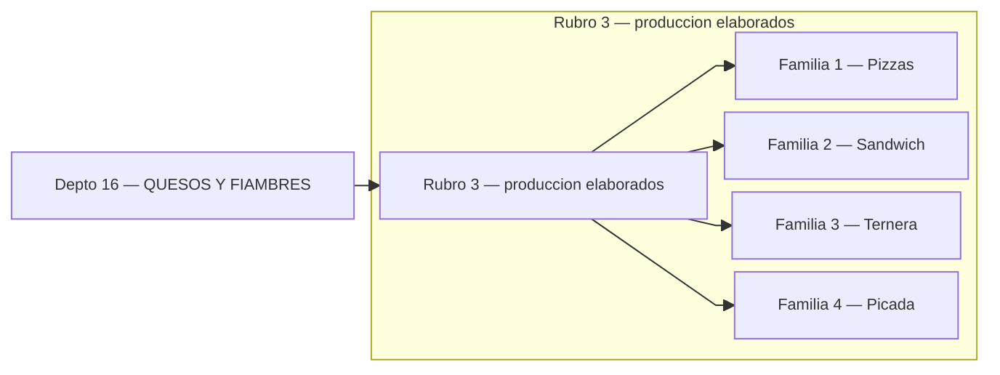
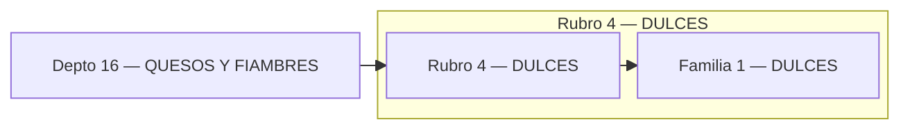
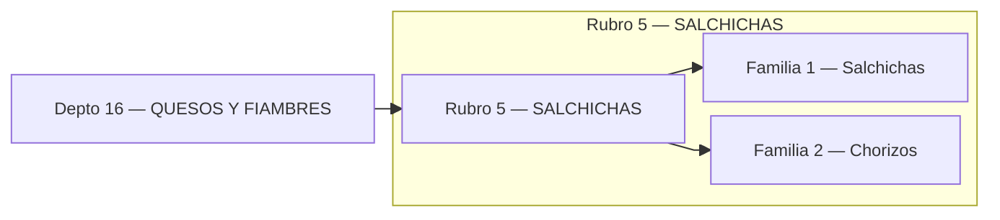
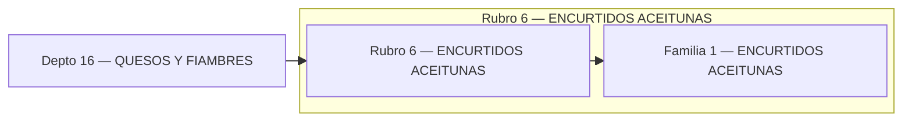

# Catálogo QUESOS Y FIAMBRES

## Índice (Depto → Rubros)

---

## Rubro 1 — FIAMBRES

## Rubro 2 — QUESOS

## Rubro 3 — produccion elaborados

## Rubro 4 — DULCES

## Rubro 5 — SALCHICHAS

## Rubro 6 — ENCURTIDOS ACEITUNAS

