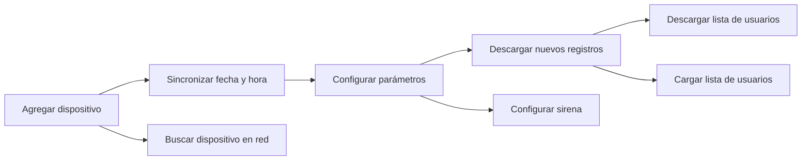
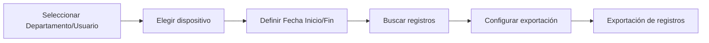

# 📘 Instructivo Básico — Uso del Software Anviz **CrossChex** (Versión en Español)

Este instructivo explica cómo usar las funciones esenciales del software **CrossChex** en español: agregar usuarios, registrar huellas, asignarlos a dispositivos y sincronizar datos.

---

# 📂 Secciones Principales del Sistema

El menú superior incluye:
- **Configuración**
- **Dispositivos**
- **Usuarios**
- **Registros**
- **Asistencia**
- **Datos**
- **Ayuda**

Todo lo referido a altas de personal, huellas y permisos se gestiona desde **Usuarios**.

---

# 👤 1. Módulo “Usuarios”

Dentro de **Usuarios**, encontrarás el panel con las siguientes acciones:

- **Agregar**
- **Modificar**
- **Eliminar**
- **Exportar**
- **Importar**
- **Asignar departamento**
- **Deshabilitar**
- **Establecer permisos**
- **Copiar permisos**
- **Descargar usuarios**
- **Descargar templates**
- **Cargar usuarios**
- **Cargar templates**
- **Eliminar del dispositivo**

---

## 🟦 1.1 Agregar un Usuario Nuevo
1. Ir a **Usuarios** → botón **Agregar**.
2. Completar los campos principales:
   - **Usuario N°**
   - **Nombre**
   - **Departamento** (opcional)
3. Guardar con **Aceptar**.

> Consejo: usar el DNI como número de usuario para mantener criterio uniforme.

---

## ✋ 1.2 Registrar Huellas Digitales
1. Seleccionar el usuario en la lista.
2. Clic en **Modificar**.
3. Buscar la pestaña o sección **Huella** (Fingerprint).
4. Elegir el dedo → presionar **Registrar** o **Enroll**.
5. Pedir al empleado apoyar el dedo **3 veces** hasta que aparezca “Registro exitoso”.
6. Guardar.
7. Finalmente, subir la huella al reloj:  
   **Cargar usuarios** → seleccionar dispositivo.

---

## 🧩 1.3 Asignar Departamento
1. Seleccionar uno o varios usuarios.
2. Clic en **Asignar departamento**.
3. Elegir el área correspondiente (Ej.: Carnicería, Caja, Administración).
4. Guardar.

---

## 🛡 1.4 Establecer Permisos (Opcional)
Sirve cuando los relojes funcionan con niveles de acceso o supervisores:

1. Seleccionar usuario.
2. Clic en **Establecer permisos**.
3. Definir si es:
   - **Usuario normal**
   - **Administrador del dispositivo**
4. Guardar.

---

# 🖥️ Módulo “Dispositivos” — CrossChex (Versión en Español)

Este módulo permite agregar relojes biométricos Anviz, configurarlos, sincronizar su hora, gestionar registros y operar funciones avanzadas como descarga por USB o activación en tiempo real.

---

# 📂 1. Gestión de Dispositivos

### ➕ **Agregar**
Sirve para incorporar un reloj nuevo al sistema.

Pasos:
1. Clic en **Agregar**.
2. Seleccionar el tipo de conexión:
   - **TCP/IP** → ingresar IP del dispositivo.
   - **USB** (si aplica).
3. Presionar **Probar conexión** para verificar comunicación.
4. Guardar con **Aceptar**.

---

### ✏️ **Modificar**
Edita la configuración de un dispositivo ya registrado.

Permite:
- Cambiar IP  
- Cambiar nombre  
- Ajustar tipo de comunicación  

---

### 🗑 **Eliminar**
Quita el dispositivo del software (no borra datos del reloj físicamente).

---

# ⏱️ 2. Sincronización y Configuración

### 🕒 **Sincronizar fecha y hora**
Ajusta el reloj interno del dispositivo para que coincida con la PC.

Recomendación: hacerlo **diariamente** o al menos una vez por semana.

---

### ⚙️ **Parámetros del dispositivo**
Abre la configuración interna del reloj:

- Volumen  
- Idioma  
- Tiempo de espera  
- Brillo  
- Tiempos de bloqueo  
- Modo de verificación (huella, PIN, tarjeta)

---

### 🔔 **Configurar sirena**
Configura alarmas o señales horarias (si el modelo lo permite).

Permite:
- Definir horarios de alerta
- Activar o desactivar campanas/sirenas internas

---

# 📥 3. Descarga y Gestión de Registros

### 📥 **Descargar nuevos registros**
Descarga únicamente las marcaciones que aún no están en el sistema.

Esto evita duplicados y reduce tiempos.

---

### 📥📥 **Descargar todos los registros**
Trae **todo** el historial del dispositivo, aunque ya haya sido descargado previamente.

Usar solo cuando sea estrictamente necesario.

---

### 👤 **Descargar lista de usuarios**
Trae desde el reloj:
- Usuarios
- Huellas (templates)
- Permisos básicos  
Ideal si el dispositivo fue configurado de forma local.

---

### 📤 **Cargar lista de usuarios**
Envía al reloj los datos guardados en el software.

Incluye:
- Usuarios
- Datos personales
- Huellas (si se cargaron anteriormente)
- Permisos

---

# 🔄 4. Filtros y Descarga de Registros por Fecha

En el panel verás:

- **Start date**
- **End date**
- **User No.**

Esto permite descargar registros filtrados por rango de fechas y/o por número de usuario.

Luego presionar **Download Records**.

---

# 🟧 5. Control en Tiempo Real

### 🔗 **Activar**
Activa comunicación en tiempo real:
- Notificaciones instantáneas  
- Conexión continua  
- Eventos en vivo (si el modelo lo soporta)

### ❌ **Desactivar**
Deshabilita la comunicación en vivo.  
El equipo sigue funcionando, pero el software no recibe eventos en tiempo real.

---

# 💾 6. Gestión de USB (Memoria Externa)

### 💽 **Unidad USB / Encontrar memoria USB**
Detecta la memoria USB conectada a la PC.

Permite trabajar con archivos descargados desde el reloj (por ejemplo, modelos que exportan logs a USB porque no están en red).

---

### 🔼 **U Operation**
Desde este menú se pueden:
- Cargar usuarios desde USB  
- Descargar registros desde USB  
- Restaurar parámetros del dispositivo  
- Exportar usuarios a USB

---

# 🔍 7. Búsqueda de Dispositivos

### 🔎 **Find Device** (Buscar dispositivo)
Busca dispositivos disponibles en la red local.

Muy útil cuando:
- No sabés la IP  
- El dispositivo obtuvo IP por DHCP  
- Se está instalando por primera vez

Permite detectarlos automáticamente.

---

# ✔ Resumen del Flujo de Uso del Módulo “Dispositivos”

---

# 📝 Notas Finales
- Mantener sincronizada la hora del reloj evita errores de asistencia.  
- Descargar **solo registros nuevos** es la forma más rápida de actualizar información.  
- “Descargar todos los registros” debe usarse solo para auditorías o recuperaciones.  
- Tener la IP fija del dispositivo facilita enormemente la estabilidad.

# 📝 Módulo “Registros” — CrossChex (Versión en Español)

El módulo **Registros** permite buscar, filtrar y exportar todas las marcaciones descargadas desde los dispositivos Anviz. Desde aquí se generan listados para control horario, auditorías y análisis.

---

# 🔍 1. Búsqueda de Registros

En la parte izquierda del módulo encontrarás los siguientes filtros:

### 🗂 **Departamento**
Permite filtrar los registros por área laboral.  
Si no seleccionas nada, mostrará todos los departamentos.

### 👤 **Usuario**
Filtra los registros para una persona específica.  
Útil cuando se necesita revisar asistencia o inconsistencias de un empleado.

### 🏷 **Record Flag**
En algunos modelos permite escoger:
- Todas las marcaciones  
- Solo entradas  
- Solo salidas  
- Marcaciones verificadas  

(Según versión del software y dispositivo)

### 🖥 **Dispositivo N°**
Selecciona desde qué reloj obtener o filtrar registros.  
Ideal cuando hay varios equipos instalados.

---

# 📅 2. Filtrar por Fechas

### 📆 **Fecha Inicio**  
### 📆 **Fecha Fin**

Selecciona el intervalo de fechas a revisar.

> Ejemplo: para ver el mes completo, elegir del 01/11/2025 al 30/11/2025.

---

# 🔎 3. Buscar Registros

Presionar el botón **Buscar registros** para mostrar los resultados según los filtros elegidos.

Los datos aparecerán en una tabla inferior con columnas típicas como:
- Usuario  
- ID  
- Fecha  
- Hora  
- Tipo de marcación (Entrada/Salida)  
- Dispositivo  

---

# 📤 4. Exportación de Registros

En la sección derecha se encuentra la configuración para exportar registros a Excel o a archivos planos.

---

## 📝 4.1 Formato de exportación
Opciones comunes:
- **Plantilla de Excel (*.xls)**  
- **Archivo texto / CSV**  
- **Formato personalizado**  

---

## 🏷 4.2 Campos de exportación
Permite definir qué información incluir en el archivo.

Ejemplo típico:
- ID de usuario  
- Fecha  
- Hora  
- Código de evento  

---

## 🕓 4.3 Formato de fecha y hora
Definido como:

`yyyy-mm-dd hh:mm:ss`

Puedes ajustarlo si necesitás un formato diferente para tu sistema.

---

## 🔠 4.4 Longitud ID de usuario
Define la cantidad de dígitos del campo "ID de usuario" en la exportación.  
Normalmente se deja en **0** (automático).

---

## 🔤 4.5 Símbolo de separación
Define cómo se separan los datos si exportás un archivo tipo texto:

- **Tab** (tabulación – recomendado)  
- **Coma**  
- **Punto y coma**  
- **Espacio**  

---

## 📏 4.6 Longitud de separación
Determina cuántos caracteres se usan como delimitador (por lo general se deja en **1**).

---

# 📤 5. Exportar Registros

Luego de elegir:
- Filtros  
- Campos  
- Formato  
- Separadores  

Presionar el botón **Exportación de registros**.

El software generará:
- Un archivo Excel  
**o**
- Un archivo texto/CSV listo para importar en otro sistema.

---

# 🗑 6. Clear Invalid Records (Eliminar registros inválidos)

Esta función elimina del sistema registros dañados o incompletos.  
Solo usar si hay errores en la descarga.

---

# 🔁 7. Flujo Básico del Módulo “Registros”

---

# ✔ Recomendaciones
- Utilizá **Fecha Inicio / Fecha Fin** para evitar archivos demasiado grandes.  
- Exportá siempre en **Excel** si necesitás compartir o imprimir listados.  
- Usá **Tab** como separador para exportaciones limpias tipo CSV.  
- Guardá las exportaciones en una carpeta organizada por mes o por sucursal.

