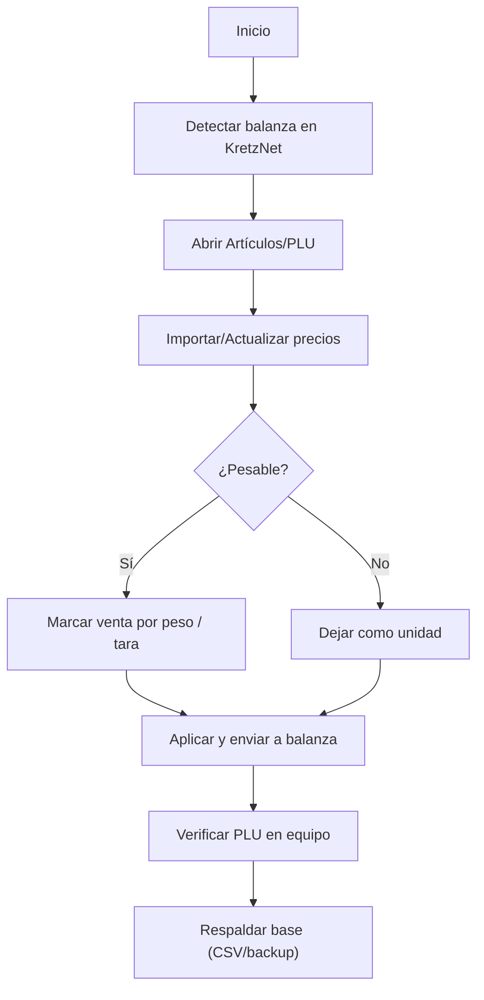

# Kretz — Cambio de precios y pesables (PROTEGIDO)

> **Aviso:** Este documento es un borrador de prueba. Ajustá nombres/menu según tu software/versión Kretz.

## Objetivo
Actualizar **precios** y parámetros de **pesables** en balanzas Kretz usando el software de gestión (KretzNet o equivalente).

## Requisitos
- PC conectada a la red de la balanza o por cable directo.
- Software de gestión Kretz instalado y con acceso.
- Archivo fuente de precios (CSV/Excel) o edición manual.

## Paso a paso (resumen)
1. **Conectar** la PC a la balanza (IP fija o detección automática).
2. Abrir **KretzNet** → *Comunicación* → **Detectar equipos** → seleccionar balanza.
3. Ir a **Artículos/PLU** → **Importar/Actualizar**.
4. Mapear columnas: **Código/PLU**, **Descripción**, **Precio**, **Es pesable** (S/N), **Tara** (si aplica).
5. Validar vista previa → **Aplicar**.
6. Enviar a equipo: **Descargar a balanza** / **Enviar programación**.
7. Verificar en balanza: leer un PLU y confirmar precio y modo pesable.
8. **Respaldar**: exportar base actualizada a CSV/backup del software.

## Notas rápidas
- Si un artículo debe ser pesable: marcar **“venta por peso”** o *flag* equivalente.
- Si cambia IVA o formato de etiqueta, revisar **plantilla de ticket/etiqueta**.
- En despliegues múltiples, repetir envío a cada balanza o usar grupo.

