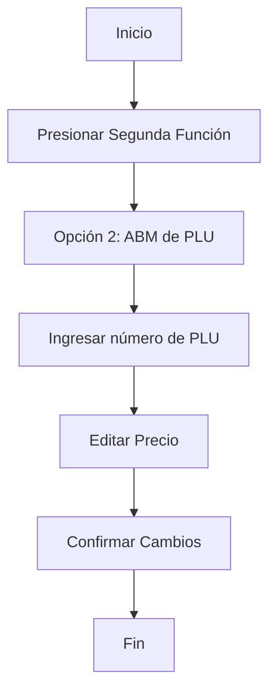

# Alta/Baja/Modificación de PLU. 
Guía práctica para cambiar precios directamente desde la balanza, tambien sirve siguiendo la logica para cambiar desde la balanza si es pesable o por unidad.

---

## 2. Cómo acceder al menú de funciones  
1. Presionar **SEGUNDA FUNCIÓN** (a veces aparece como *2F*, *SF* o *FUNC*).  
2. Ingresar a las **opciones internas** del equipo.  
3. Utilizar las teclas numéricas para navegar.

---

## 3. Cambiar el precio de un PLU directamente desde la balanza

### 📌 Pasos detallados

1. Presionar **SEGUNDA FUNCIÓN**.  
2. Seleccionar la opción:  
   **2 – ABM de PLU** (Alta, Baja y Modificación de artículos).  
3. La balanza solicitará el número de PLU (ejemplo: 001, 010, 150).  
4. Ingresar el **PLU** que querés editar y confirmar con **TARA** o **ENTER** (según modelo).  
5. Se abrirán los campos del artículo. Normalmente verás:  
   - Descripción  
   - Precio por kg  
   - Departamento  
   - Tara  
   - Fecha de vencimiento  
6. Navegar hasta **PRECIO**.  
7. Ingresar el precio nuevo (sin coma; la balanza interpreta los decimales).  
   - Ejemplo: para 2.495 pesos → ingresar **2495**  
8. Confirmar los cambios.  
9. Salir con **BORRAR** o **SALIR** hasta volver a la pantalla principal.

---

## 4. Notas importantes
- Si el artículo tiene **dos líneas de descripción**, ambas pueden editarse desde la opción de ABM.  
- Algunas versiones permiten bloquear campos; si no te deja editar, revisá la opción de **permisos de operador**.  
- Para enviar los cambios por red/PC se usa software Kretz, pero este instructivo cubre únicamente la edición **local**.

---

## 5. Problemas frecuentes
- **No deja editar el precio:** revisar permisos o modo de operador.  
- **PLU inexistente:** darlo de alta desde la misma opción ABM (Elegir “ALTA”).  
- **No imprime el precio actualizado:** reiniciar la impresora interna o verificar formato de etiqueta.

---

## 6. Flujo

```mermaid
flowchart TD
    A[Inicio] --> B[Presionar Segunda Función]
    B --> C[Opción 2: ABM de PLU]
    C --> D[Ingresar número de PLU]
    D --> E[Editar Precio]
    E --> F[Confirmar Cambios]
    F --> G[Fin]
```

---

## 7. Resumen rápido
- **2F → 2 ABM PLU → elegir PLU → editar precio → confirmar.**

---
