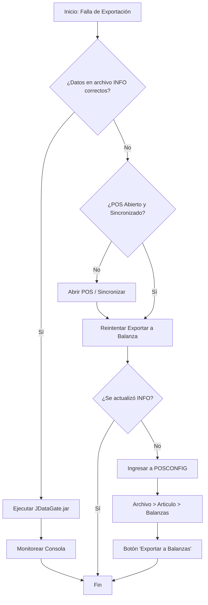

# Solución de problemas: Exportación a Balanza

## 1. Introducción
Esta guía documenta el procedimiento para resolver fallas en la exportación de artículos a las balanzas Kretz. Específicamente, se enfoca en situaciones donde el proceso estándar de envío de novedades (artículos nuevos o modificaciones de precios y descripciones) no se completa exitosamente.

El objetivo es proporcionar un flujo de trabajo claro para diagnosticar y solucionar el problema, asegurando que la información en la balanza esté sincronizada con el sistema de gestión.

## 2. Diagnóstico Inicial
Cuando la exportación a la balanza no muestra errores de conectividad visibles, pero los cambios no se reflejan en el equipo, se recomienda verificar primero la configuración básica del artículo:
1.  **Código de barras:** Verificar que esté correctamente configurado.
2.  **Tipo de artículo:** Asegurarse de que el artículo esté marcado como "Pesable".

## 3. Procedimiento de Resolución

### 3.1 Identificación del DataGate
Para investigar el problema, debemos acceder a los archivos de transmisión de la balanza.
1.  Navegar a la ruta: `C:\DLR\balanzas\kSolutions`
2.  Identificar la carpeta del **DataGate** correspondiente a la balanza con problemas.
    *   Si no sabes cuál es, ingresa a cada carpeta, abre el archivo `COM` (o `COM.txt`) con el Bloc de notas.
    *   Verifica la **IP** que figura en el archivo para confirmar que corresponde a la balanza deseada.

### 3.2 Análisis del archivo INFO
Dentro de la carpeta del DataGate identificado:
1.  Abrir el archivo `info` (o `info.txt`) con el Bloc de notas.
2.  Buscar el artículo problemático (Ctrl + B) por descripción o número de PLU.

**Interpretación de los datos:**
El archivo contiene columnas con atributos del artículo. Prestar atención a la segunda columna de atributos:
*   **Primeros 5 dígitos:** Corresponden al número de PLU.
*   **Letra siguiente:** Indica el tipo de pesable.
    *   `P`: Pesable por **Peso** (kg).
    *   `N`: Pesable por **Unidad** (un).
*   **Números siguientes:** Indican el precio (ignorando los ceros no significativos).

---

### 3.3 Escenarios de Solución

#### Escenario A: Los datos en INFO son correctos
**Síntoma:** El artículo aparece en el archivo `info` con el tipo de pesable (`P` o `N`) y el precio correctos.
**Causa probable:** Micro-cortes en la red impidieron la actualización completa, aunque el proceso de exportación no reportó error.

**Solución:**
1.  Ejecutar el archivo Jar `JDataGate` ubicado en la carpeta de DataGate.
2.  Este ejecutable forzará el envío de la información contenida en `info` a la balanza.
3.  Monitorear la consola que se abre para detectar posibles errores de conectividad en tiempo real.

#### Escenario B: Los datos en INFO son incorrectos o inexistentes
**Síntoma:** El artículo no aparece en el archivo `info`, o aparece con datos desactualizados.
**Causa probable:** La información no está llegando correctamente desde el POS al sistema de balanzas. Ejecutar `JDataGate` no servirá porque enviará los mismos datos erróneos.

**Solución:**
1.  **Verificar el POS:**
    *   Asegurarse de que el POS (Caja) esté abierto y sincronizado.
    *   La caja es la encargada de enviar la información a la balanza. Si el POS no está operativo o sincronizado, la información no llegará.
    *   Prueba: Intentar pasar el artículo por caja para verificar que allí sí funcione correctamente.

2.  **Reintentar Exportación:**
    *   Una vez verificado el POS, ejecutar nuevamente el script ubicado en el escritorio "Exportar a balanza".
    *   Revisar el archivo `info` nuevamente para ver si se actualizó.

**Solución Avanzada (POSCONFIG):**
Si tras los pasos anteriores el archivo `info` sigue sin actualizarse:
1.  Ingresar a **POSCONFIG** (requiere usuario con permisos, solicitar a DLR si es necesario).

2.  Ir al menú: **Archivo > Artículo > Balanzas**.

3.  Presionar el botón **"Exportar a Balanzas"**.
    *   *Nota:* Esta acción suele forzar la actualización y resolver el problema.

4.  **Importante:** Cerrar POSCONFIG al finalizar.

> [!WARNING]
> **Precaución:** No utilizar POSCONFIG como solución por defecto. Es una herramienta de configuración sensible. Si se requiere usar esto frecuentemente, se debe investigar la causa raíz de por qué el proceso estándar (Caja -> Exportar) está fallando.

## 4. Flujo de Resolución

