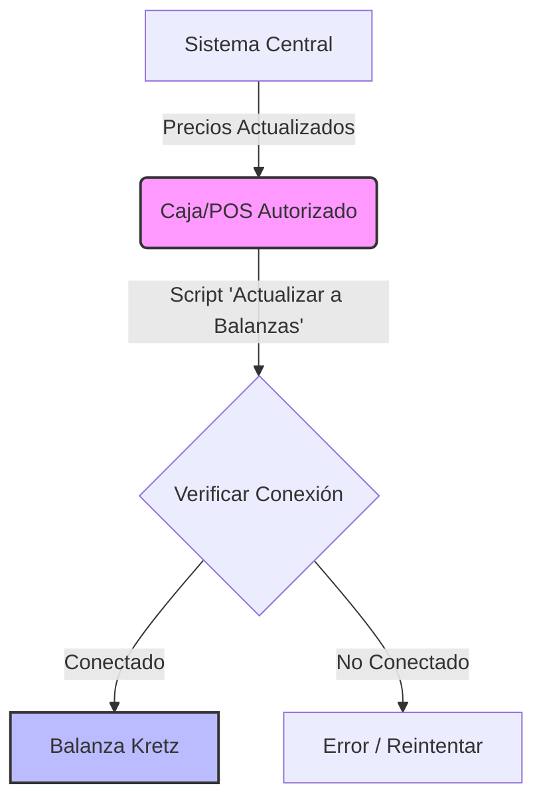

# Exportar a Balanza Kretz

El proceso de actualizar balanza consiste en pasar los precios actualizados por sistema a las balanzas Kretz conectadas por red. Aunque es un proceso simple para el usuario común, requiere verificar ciertas condiciones previas para asegurar su éxito.

## Diagrama de Flujo

## ¿Desde dónde se actualiza?

Contamos con 2 sucursales (Santiago y Corrientes) con balanzas Kretz Report NX conectadas a la red. La actualización debe realizarse **exclusivamente** desde las siguientes cajas autorizadas:

| Sucursal | Caja | Notas |
| :--- | :--- | :--- |
| **Santiago** | 2 y 3 | |
| **Corrientes** | 4 | |
| **Corrientes** | 5 | Solo usuarios avanzados |

## Consideraciones Previas

Antes de exportar, verifique los siguientes puntos:

### 1. Estado del POS
> [!IMPORTANT]
> El POS debe estar **abierto y sincronizado**.

Es fundamental validar que la caja desde la cual se actualizará ya tenga los precios nuevos. El precio que tenga la caja es el que se enviará a la balanza.

### 2. Conectividad de la Balanza
Verifique que la balanza esté conectada a la red.

*   **Indicador Visual:** Busque el icono de red en la pantalla LED de la balanza.

*   **Reinicio:** Si tiene dudas, reinicie la balanza. Al encender, mostrará un mensaje confirmando la conexión.
*   **Verificación Manual:**
    1.  Ingrese al menú como **Administrador**.
    2.  Vaya a **Configuración de Red**.
    3.  Presione `Enter` sin modificar nada hasta forzar el intento de conexión.

## Ejecución del Proceso

Una vez verificados el POS y la conectividad:

1.  Diríjase a una de las cajas autorizadas.
2.  Ejecute el script **"ACTUALIZAR A BALANZAS"**.
3.  **Monitoree el resultado:** Revise que no aparezcan errores en pantalla.
4.  Si el proceso finaliza sin errores, las balanzas de la sucursal estarán actualizadas. En caso de error, reintente el proceso.
