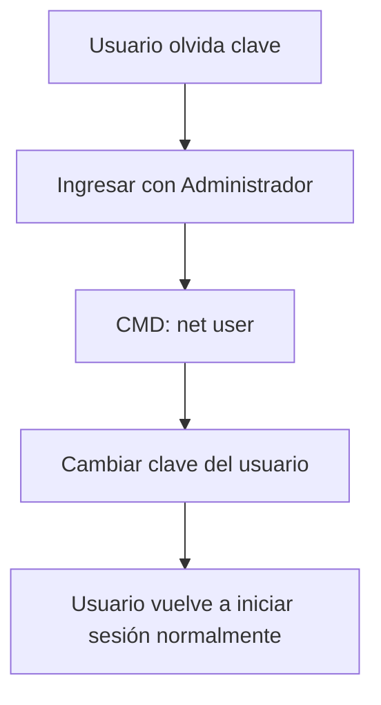

# Informe: Creación y Uso del Usuario Administrador en Windows

Este documento describe cómo habilitar un usuario administrador en Windows, asignarle una clave propia y utilizarlo para recuperar contraseñas de otros usuarios. El objetivo es garantizar que la PC nunca quede inutilizable en caso de pérdida o cambio de clave de los usuarios habituales.

---

## 1. Habilitar el Usuario Administrador

1. Inicia sesión en Windows con cualquier cuenta que tenga privilegios administrativos.  
   *(Si aún no existe, primero deberás activar el modo seguro o usar un método de recuperación para acceder con privilegios).*

2. Abre el **Símbolo del sistema (CMD) como administrador**:
   - Presiona `Win + R`, escribe `cmd`.
   - Haz clic derecho sobre `cmd.exe` → **Ejecutar como administrador**.

3. Habilita la cuenta de administrador con el siguiente comando:

   ```cmd
   net user administrador /active:yes
   ```

   - En sistemas en inglés el comando sería:
     ```cmd
     net user administrator /active:yes
     ```

4. Asigna una contraseña segura a esa cuenta:

   ```cmd
   net user administrador MiClaveSegura123
   ```

   *(Reemplaza `MiClaveSegura123` por una clave robusta y que recuerdes).*

---

## 2. Acceder con el Usuario Administrador

1. Cierra sesión en Windows.  
2. En la pantalla de inicio de sesión aparecerá ahora la cuenta **Administrador**.  
3. Inicia sesión con la contraseña configurada.  
4. Este usuario tiene privilegios completos, pero **no se recomienda usarlo para trabajo diario**. Su función es únicamente de **recuperación y soporte**.

---

## 3. Recuperar o Cambiar la Clave de Otro Usuario

Cuando un usuario olvide su contraseña:

1. Inicia sesión con la cuenta **Administrador**.  
2. Abre **CMD como administrador**.  
3. Lista todos los usuarios del sistema:

   ```cmd
   net user
   ```

4. Cambia la contraseña del usuario afectado:

   ```cmd
   net user NOMBRE_USUARIO NuevaClave
   ```

   Ejemplo:
   ```cmd
   net user Juan 123456
   ```

5. El usuario podrá iniciar sesión con la nueva clave inmediatamente.

---

## 4. Mantener los Usuarios sin Restricciones

- Los usuarios habituales seguirán trabajando normalmente, sin limitaciones ni bloqueos.  
- No es necesario convertirlos en administradores.  
- La cuenta **Administrador** solo se usará en emergencias para recuperar claves o gestionar el sistema.

---

## 5. Recomendaciones de Seguridad

- **No uses** el usuario administrador para tareas diarias.  
- Guarda la clave en un lugar seguro (puede ser en un gestor de contraseñas o un sobre cerrado en un sitio confiable).  
- Considera desactivar nuevamente el administrador tras usarlo, con el comando:

  ```cmd
  net user administrador /active:no
  ```

- Si decides mantenerlo activo, asegúrate de que la clave sea **fuerte y única**.

---

## Diagrama de Flujo (Recuperación de Clave)



---

## Conclusión

Al habilitar y configurar la cuenta de **Administrador** con una contraseña propia, se asegura un acceso de emergencia al sistema. Esto evita que la computadora quede inutilizable y permite recuperar las claves de los usuarios de manera rápida, sin restringir su trabajo cotidiano.


