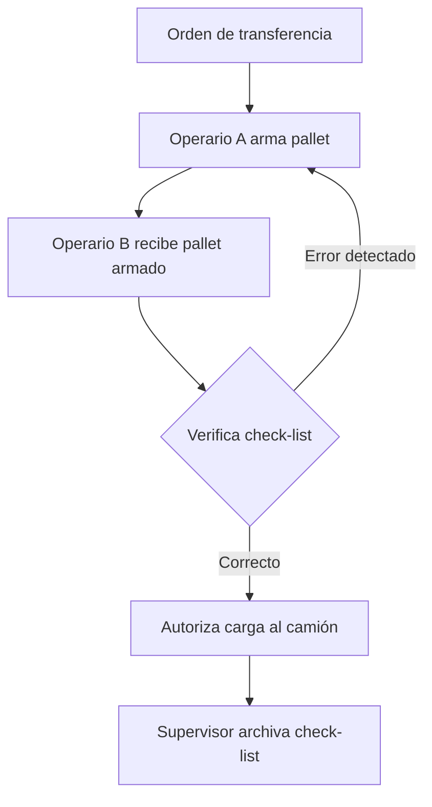
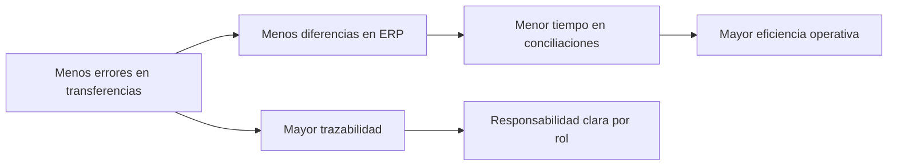

# 📦 Procedimiento de Control Físico + Digital en el Armado de Pallets

## 🎯 Objetivo
Reducir los errores humanos en el proceso de **transferencia de mercadería entre sucursales**, asegurando que lo enviado coincida con lo registrado en el ERP y que llegue a la sucursal correcta.

---

## 1. Roles Involucrados
- **Operario A (Armador):** arma el pallet siguiendo la orden de transferencia.  
- **Operario B (Controlador):** revisa el pallet armado y completa el check-list de verificación.  
- **Supervisor:** recibe y archiva los check-lists como evidencia y trazabilidad.  

---

## 2. Flujo del Proceso

---

## 3. Paso a Paso

### Paso 1 — Armado
- Operario A recibe la **orden de transferencia** (papel o sistema).  
- Arma el pallet con la mercadería.  
- Coloca **etiqueta interna** con: número de transferencia + sucursal destino.  

### Paso 2 — Verificación
- Operario B recibe la orden y el pallet armado.  
- Completa un **check-list** verificando:  
  - Número de transferencia.  
  - Sucursal destino.  
  - Artículos coinciden con la orden.  
  - Cantidades coinciden con la orden.  

### Paso 3 — Autorización
- Si todo está correcto, Operario B firma y autoriza la carga.  
- Si hay errores, devuelve a Operario A para corrección.  

### Paso 4 — Registro
- Supervisor archiva el check-list firmado como prueba de control.  

---

## 4. Ejemplo de Check-list

| Campo              | Dato esperado      | Dato verificado | ✔/✖ |
|--------------------|-------------------|-----------------|-----|
| N° Transferencia   | 12345             | 12345           | ✔   |
| Sucursal destino   | Suc 2             | Suc 2           | ✔   |
| Artículo A         | 50 unidades       | 50              | ✔   |
| Artículo B         | 30 unidades       | 25              | ✖   |

**Firmas:**  
- Armador: ____________  
- Controlador: ____________  
- Fecha y hora: ____________  

---

## 5. Beneficios

---

## 6. Opcional (Mejora Tecnológica)
- Usar **Google Forms, Excel en tablet o app interna** para check-lists → reportes en tiempo real.  
- Incorporar **lectores de código de barras** para que Operario B valide artículos y cantidades.  

---

## ✅ Conclusión
El **doble control (armador + verificador)** asegura que la transferencia sea validada antes de salir, evitando errores graves de destino o cantidades y creando **trazabilidad profesional** del proceso.
