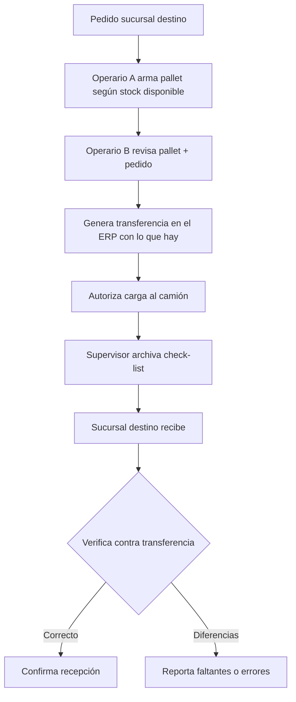
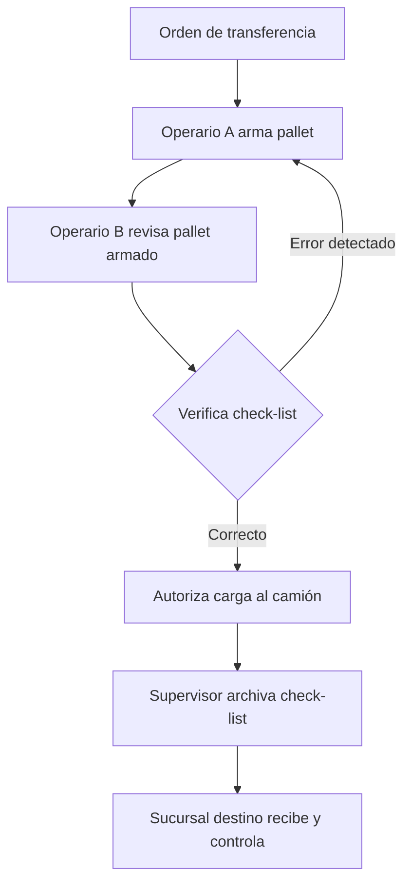
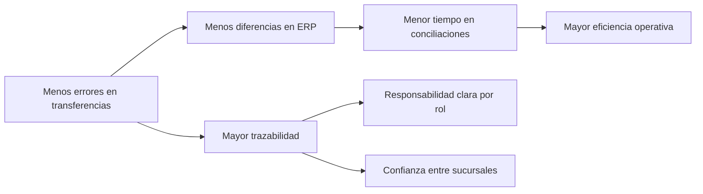

# 📦 Procedimiento de Control Físico + Digital en el Armado de Pallets

## 🎯 Objetivo
Reducir errores en el proceso de **transferencia de mercadería entre sucursales**, garantizando que lo enviado coincida con lo registrado en el ERP y que llegue correctamente a destino.  
Se contemplan **dos escenarios operativos**:
1. Transferencia con **pedido previo de sucursal destino**.  
2. Transferencia **sin pedido previo** (envío directo desde sucursal origen).  

---

## 1. Roles Involucrados
- **Operario A (Armador):** arma el pallet en base al pedido o al stock disponible.  
- **Operario B (Controlador):** revisa el pallet armado y genera la transferencia en el sistema.  
- **Supervisor Origen:** archiva los check-lists como evidencia de control.  
- **Sucursal Destino:** recibe, controla y confirma la mercadería recibida.  

---

## 2. Flujos del Proceso

### Escenario A — Con Pedido Previo

```mermaid
flowchart TD
    A[Pedido sucursal destino] --> B[Operario A arma pallet según stock disponible]
    B --> C[Operario B revisa pallet + pedido]
    C --> D[Genera transferencia en el ERP con lo que hay]
    D --> E[Autoriza carga al camión]
    E --> F[Supervisor archiva check-list]
    F --> G[Sucursal destino recibe]
    G --> H{Verifica contra transferencia}
    H -->|Correcto| I[Confirma recepción]
    H -->|Diferencias| J[Reporta faltantes o errores]
```

---

### Escenario B — Sin Pedido Previo

```mermaid
flowchart TD
    A[Orden de transferencia] --> B[Operario A arma pallet]
    B --> C[Operario B revisa pallet armado]
    C --> D{Verifica check-list}
    D -->|Correcto| E[Autoriza carga al camión]
    D -->|Error detectado| B
    E --> F[Supervisor archiva check-list]
    F --> G[Sucursal destino recibe y controla]
```

---

## 3. Paso a Paso

### Escenario A — Con Pedido
1. **Armado**  
   - Operario A recibe el **pedido de sucursal destino**.  
   - Arma el pallet con lo disponible en stock.  
   - Marca los faltantes en una **observación interna**.  
   - Coloca etiqueta con: número de pedido + sucursal destino.  

2. **Verificación y Transferencia**  
   - Operario B revisa el pallet contra el pedido recibido.  
   - Registra en el ERP una **transferencia ajustada a lo que hay**.  
   - Completa check-list validando: pedido vs pallet vs transferencia.  

3. **Autorización y Envío**  
   - Si coincide, autoriza carga.  
   - Si hay diferencias graves, devuelve a Armador.  

4. **Recepción en Sucursal Destino**  
   - Controlan la transferencia recibida vs mercadería real.  
   - Confirman en ERP o reportan diferencias.  

---

### Escenario B — Sin Pedido
1. **Armado**  
   - Operario A recibe la **orden de transferencia**.  
   - Arma pallet completo con la mercadería indicada.  
   - Coloca etiqueta con: número de transferencia + sucursal destino.  

2. **Verificación**  
   - Operario B revisa artículos y cantidades contra la orden.  
   - Completa check-list de validación.  

3. **Autorización**  
   - Si coincide, autoriza la carga.  
   - Si no, devuelve a Armador para corrección.  

4. **Registro y Archivo**  
   - Supervisor guarda check-list firmado.  
   - Sucursal destino controla recepción contra transferencia.  

---

## 4. Ejemplo de Check-list

| Campo              | Dato esperado      | Dato verificado | ✔/✖ |
|--------------------|-------------------|-----------------|-----|
| Pedido/Transferencia | 56789 / 12345   | 56789 / 12345   | ✔   |
| Sucursal destino   | Suc 2             | Suc 2           | ✔   |
| Artículo A         | 50 unidades       | 50              | ✔   |
| Artículo B         | 30 unidades       | 25              | ✖   |
| Observaciones      | Faltan 5 unid.    | Registrado       | ✔   |

**Firmas:**  
- Armador: ____________  
- Controlador: ____________  
- Supervisor: ____________  
- Fecha y hora: ____________  

---

## 5. Beneficios

```mermaid
graph LR
    A[Menos errores en transferencias] --> B[Menos diferencias en ERP]
    B --> C[Menor tiempo en conciliaciones]
    C --> D[Mayor eficiencia operativa]
    A --> E[Mayor trazabilidad]
    E --> F[Responsabilidad clara por rol]
    E --> G[Confianza entre sucursales]
```

---
