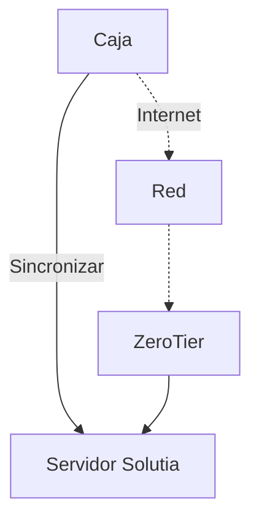
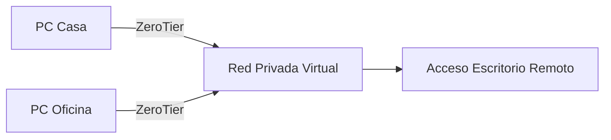

# Procedimiento de error de sincronización de caja

Este procedimiento sirve como guía práctica para resolver el problema cuando una **caja no logra sincronizar** con el sistema.  
El último paso recomendado es verificar el servicio **ZeroTier**, ya que en la mayoría de los casos es lo que soluciona definitivamente el inconveniente.

---

## 1) Identificar el problema

---

## 2) Verificar sincronización desde Solutia
1. Ingresar al sistema **Solutia**.  
2. Ir a la ruta: **Herramientas → Sincronización → Nodos**.  
3. Desde allí, seleccionar el nodo correspondiente.  
4. Presionar el botón **Sincronizar nodo**.

  

- Si la sincronización se completa correctamente → el problema queda resuelto.  
- Si arroja **error**, continuar con el siguiente paso.

---

## 3) Verificar conexión a Internet en la caja
1. Revisar que la caja tenga acceso a Internet (abrir un navegador, hacer ping, etc.).  
2. Si **no hay Internet**, resolver la conectividad antes de continuar.  
3. Si **hay Internet** y el error persiste, avanzar al paso final.

---

## 4) Verificar ZeroTier en Windows (solución final)

ZeroTier es un software que conecta la caja a la red privada de la empresa como si estuviera en la misma LAN, aunque esté en otro lugar.  
Si este servicio no está funcionando, la sincronización suele fallar.

### Pasos para corroborar:
1. Presionar `Win + R`.  
2. Escribir `services.msc` y presionar **Enter**.  
3. En la lista de servicios, buscar **ZeroTier One**.  
4. Verificar en la columna **Estado**:  
   - Si dice **En ejecución**, el servicio está activo.  
   - Si está vacío, hacer clic derecho → **Iniciar**.  
5. (Opcional) Configurar el inicio automático: clic derecho → **Propiedades** → Tipo de inicio → **Automático**.

---

## 5) Diagrama visual de la solución

**Explicación:**  
- La caja intenta sincronizar directo con el servidor.  
- Si falla, primero se revisa Internet.  
- Si hay Internet pero igual no sincroniza, se verifica que **ZeroTier** esté corriendo.  
- Al reactivar ZeroTier, la caja vuelve a estar conectada a la red privada y la sincronización se completa.

---

# Anexo — Verificar ZeroTier en Windows

ZeroTier es un software que crea una red privada virtual (VPN) sencilla.  
Permite conectar computadoras de diferentes lugares como si estuvieran en la **misma red local**, lo que facilita usar Escritorio Remoto o compartir archivos.

---

### Pasos para corroborar si ZeroTier está corriendo

1. **Abrir la ventana de servicios**
   - Presionar `Win + R`.
   - Escribir `services.msc` y presionar **Enter**.

2. **Buscar el servicio de ZeroTier**
   - En la lista, ubicar: **ZeroTier One**.

3. **Verificar estado**
   - Columna **Estado**:
     - Si dice **En ejecución** → ZeroTier está funcionando.
     - Si está vacío → clic derecho y elegir **Iniciar**.

4. **Configurar inicio automático (opcional)**
   - Clic derecho en **ZeroTier One** → **Propiedades**.
   - En **Tipo de inicio**, seleccionar **Automático**.
   - Confirmar con **Aceptar**.

---

### Diagrama visual (cómo funciona)

En este ejemplo, aunque la PC de casa y la de oficina estén en lugares distintos, **ZeroTier** las conecta en la misma red privada.  
De esta manera, se puede usar Escritorio Remoto como si ambas estuvieran conectadas por el mismo router.
